# 一、题型

### 时间分配

### 评分标准

`注意语言的正式性，使用多种表达方式，保证语法正确、逻辑清晰`

### 黄金原则

**

2：3：2相比开头段和结尾段，中间论述段稍长一些

### 语域问题

I am不要写成I’m ;could not 不要写成couldn’t;television不要写成TV

You用One代替

# 二、满分句型与高分词汇

`替换建议：记两个单词一短语足矣，可在作文实战中使用以便巩固`

:star: 代表推荐

### 1.简单句

被动

##### parents

##### should

:star: be suppose to、ought to

##### we us people

部分替换后 

##### not

:star: scarcely、under no circumstances

一篇文章最多使用三次表示think的含义，单词和短语共记2-3个即可

##### think

:star: assume、contend、Cling to the perspective that

##### very

:star: extraordinarily、exceedingly、more than

通常文章总结重要观点时使用

##### serious

:star: grievous、be of great severity

##### 

#### there be句型

`有许多的原因解释我的观点`建议写在第二段的第一句话

之后可接过渡词等，首先、其次、此外、更重要的是、最后但同样重要

##### many

选择2个即可:star: an army of 、a multitude of

:star: plentiful、immense amounts of

##### reason

:star: factors

##### explain

:star: account for 、give rise to

##### idea

:star: point of view

#### 比较结构

##### as as

 

##### be

`注：现在进行时与被动语态不可替换`

:star: seem、become

:star: gorgeous、graceful

:star: significant、indispensable、play a key role in 

##### the more

### 2.并列句

#### and

:star: simultaneously、likewise、in the meanwhile

#### but

:star: nevertheless、on the contrary

#### 图表

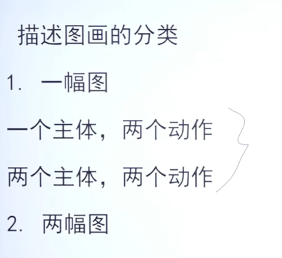

#### not only but (also)

### 3.复合句

#### (1)主语从句

##### it that

此类句型比较灵活，可以出现在任何句子的前面，可用来拉长句子

:star: 

将It 替换为What并添加谓语动词，此时之前单纯的主语从句变为主语从句中嵌套表语从句

`从句之中套从句`

eg :It has been found that——>What has been found is that 

#### (2)同位语从句

#### (3)定语从句

只要见到名词，都可有意识的加一个定语成分，将句子拉长

##### 描述图画的万能定语

:star: enthusiastic as well as passionate、who looks distinctly impressive to readers 

 :star:pesimistic、double-faced、who looks rather less impressive to readers

##### 满分表达

非限制性定语从句，可出现在作文中任何一句话的后面，对前面的内容进行解释说明

推荐写在作文的第二段

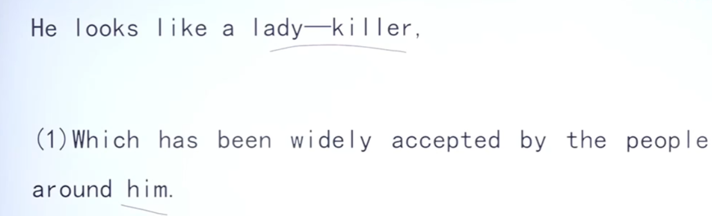

1-3表达好坏皆可，4、5只能表达坏的意思

##### 举例

#### (4)状语从句

##### 描述图画万能状语

##### 分析原因万能状语

##### 替换1

:star:attach great importance to 、shed light on 

##### 替换2

:star: phenomenon 、current situation 

##### 满分表达

`although`让步

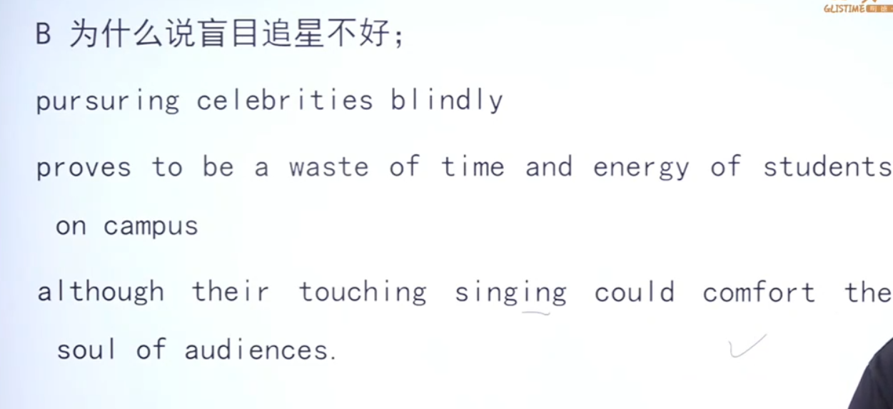

`so that`结果

`分词作状语`（放在句子的主谓之间作为插入语使用）

（例1为独立主格）

##### 举例

### 4.特殊结构

#### 双重否定

#### 修辞

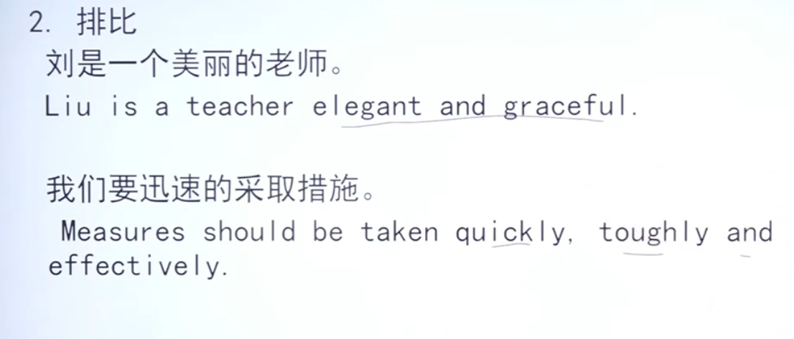

##### 举例

#### 强调句

:star: 写在第一段的最后一句话/第二段的第一句话/第三段的第一句话

It is numerous factors that there exist to account for the phenomenon.(强调factors)

It is there that exist numerous factors to account for the phenomenon.（强调there）

It is confidence that should be ….

#### 倒装

##### 万能表达

:star: 放在第一段最后一句话/第三段第一句话

#### 虚拟语气

##### 万能表达

:star: 放在第二段分析原因/第三段第一句表示观点

:star: 在第三段，实施具体措施时使用

其中可使用双重否定can not fail to，且建议具体措施写的越具体越好（反例:保护环境、有自信），主语可以为我们、父母、大学生、中国消费者等

##### 举例

# 三、段落论述方式

### 1.常用

### 2.定义和解释

此类论证方式，推荐写在第一个原因分析

### 3.统计和事实

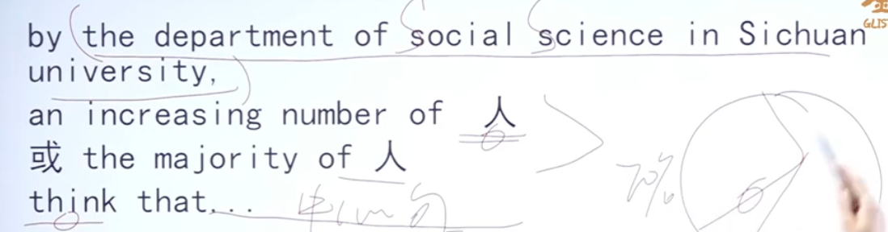

根据四川大学社会科学院的统计表明，大部分社会人数/越来越多的。。。人

此处think使用单词/短语替换如assume

### 4.引用名人名言

若积累的名言对于具体写作不太合适，可使用推荐句型自己创造

eg：污染对于全人类来说，就像严重的自然灾害对于手无寸铁的当地人一样

### 5.举例

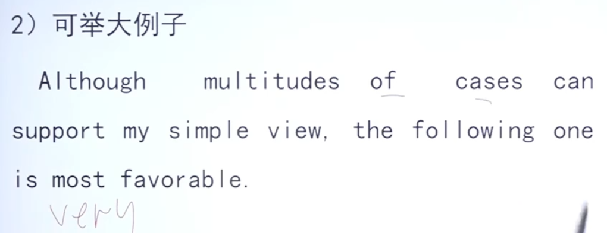

### 6.因果论证

Fitness is the foundation of any revolution.健康是革命的本钱

`当某个原因直接分析时比较短，可适度补充定语和状语将其拉长，如果加不了则使用万能状语或使用非限制性定语从句`

# 四、作文模板

## 图画作文

### 第一段（描述+中心）

#### 1.第一二句

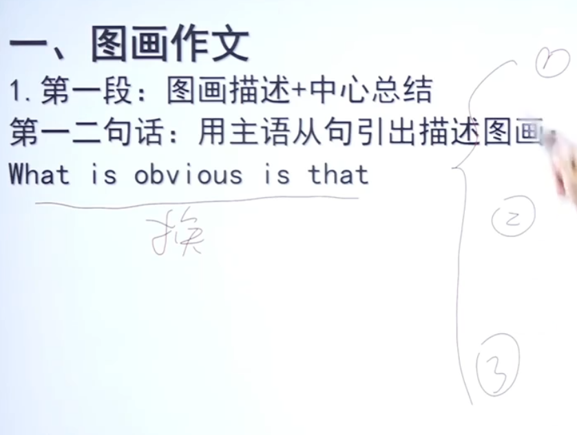

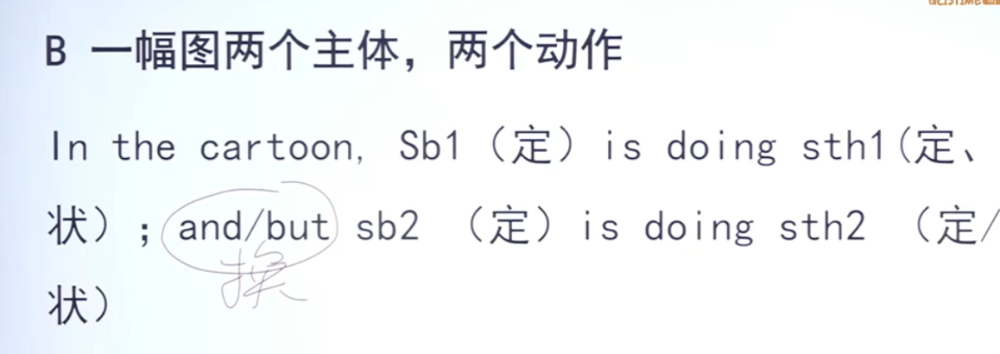

#### 2.第三句

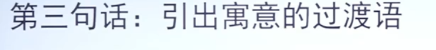

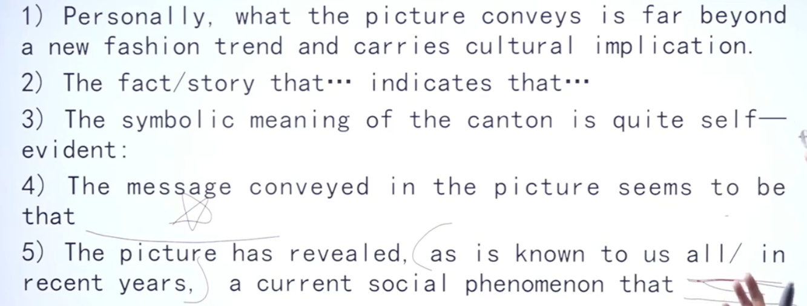

#### 3.第四句

##### 举例

### 第二段（1-3个原因分析）

##### 举例

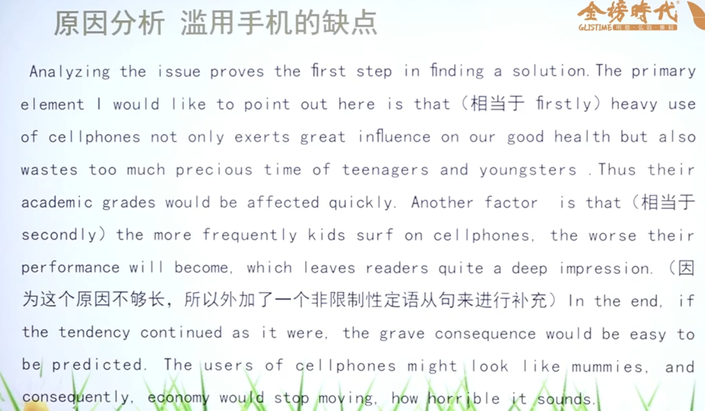

### 第三段（总结）

#### 1.第一句

#### 2.第二（三）句

#### 3.最后一句

`常用为总结法，扎实的功底建议使用引语法`

eg1:正如美国总统罗斯福所说的那样，我们正处于问题中间，但我们行动了，我们正确大胆地采取了行动

eg2:正如中国老话所说的那样，百善孝为先

##### 举例

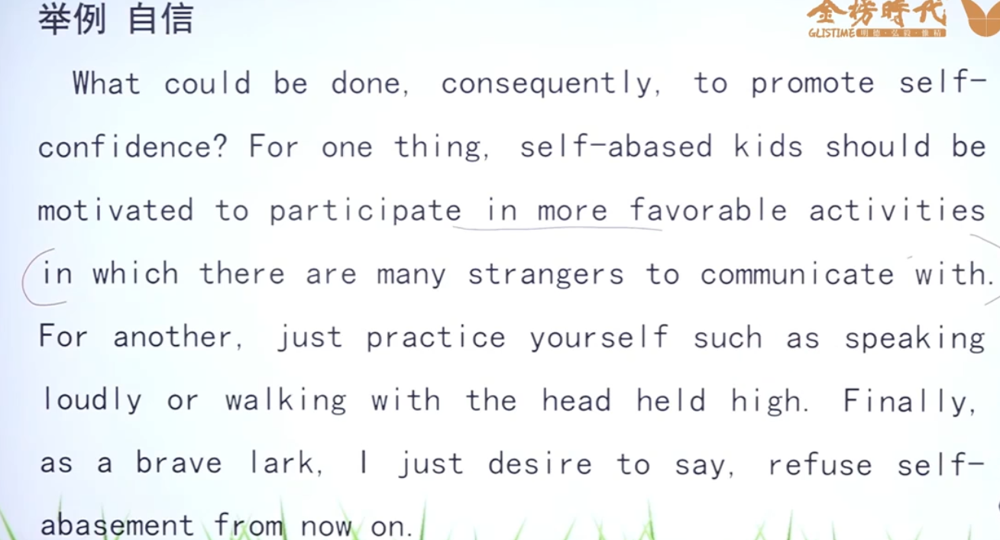

## 图表作文

### 第一段

#### 第一二句主语从句引出中心

#### 第三句

`引出文章中心的过渡语，同图画作文`

#### 第四句

`中心句`，建议自己写（可使用被动），因为数据反映的是事实且灵活多变，eg：越来越多的中国人支持国货

`中心句可使用强调句稍作润色`

##### 举例

### 第二段（原因分析）

### 第三段

`总结写出具体措施/预测趋势`

## 公务书信（应用文）

`不必使用过多特殊结构，通顺简洁明了即可`

### 称呼

### 正文

#### 第一段

##### 1.自我介绍

##### 2.写作目的

#### 第二段

`按题干要求来写`

##### 举例

切勿写总起句（反例:There are several factors concerning my resign as follows.），原因：字数要求有限

直接写辞职理由

末尾例子可以使用具体的，如即使图书馆有空调，但夏天太热了

`句末适当加状语/定语从句，可使用So that半倒`

#### 第三段

## 私人书信

### 第一段

### 第二段

同公务书信

### 第三段

期待回信，同公务书信

一句话写文章要求的内容，一句话写祝福语

若未给出要求，代我向你母亲问好，期待你的回复

## 告示类文章

分两段即可，无需写称呼

### 第一段

具体论述同公务书信第二段，so that、主语从句、简单句＋状语等皆可使用

### 第二段

留电话/邮箱地址，落款文中一定已给出

`至少达到能够自己梳理作文分类及方法，背诵并默写各个万能表达，才算是真正入门`

`PS：以上写作模板中心围绕考研英语，但英语写作的本质与核心不变，可细细体悟`