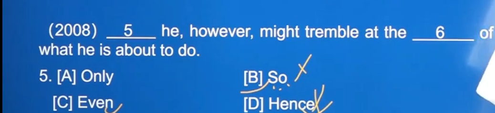
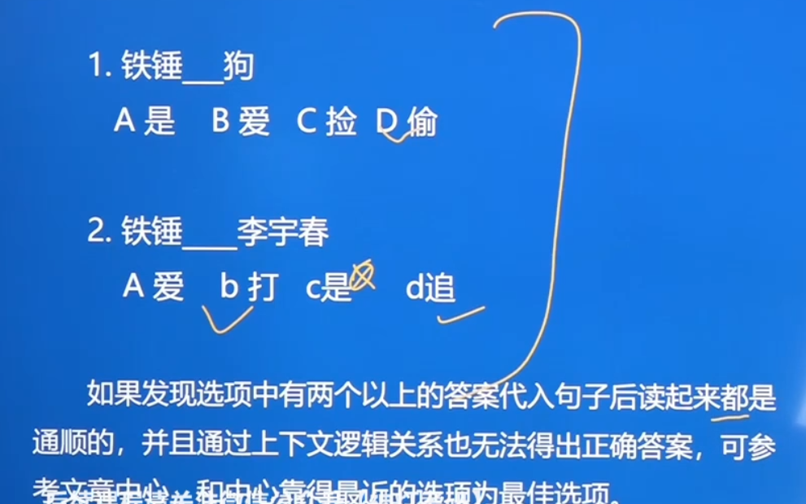
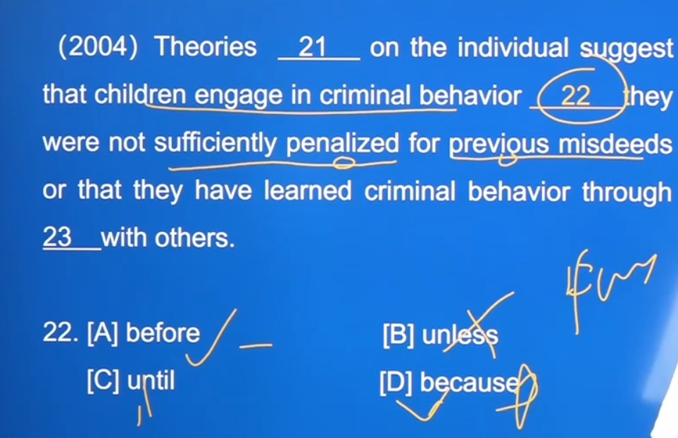

## 一、概述

### 1.答案总体分布规律

无家可归之人已经达到了当地政府不可能`处理`的比例，且因为空仅填一个动词，后面不接宾语，故使用不及物动词cope（stand为及物动词，后面需要接宾语），故选B

前文不敢，But后接敢于，剩下BD 、又因D带有感情色彩，而想表达的仅是敢于，故选B

后文几乎都在表达，如何去`帮助`这些无家可归的人故选A

### 2.特点

此篇文章的中心为人不要太聪明，即学会什么时候去`停止`，适可而止

原文想表达举例For example，但选项中没用，则选择一个表示并列关系的词（最佳选项），即C

此段出现在原文的第三段，表示与其他段想表达的内容相反，即转折关系

### 3.考点

### 4.做题步骤

当一篇文章做完后，应自己亲自再读一遍，确认是否通顺及与中心相符

## 二、做题方法

### （一）动词做题方法

#### 1.看主语和宾语的逻辑关系

#### 2.看主语

#### 3.看宾语

#### 4.固定搭配

#### 5.看动词后有无宾语

后面没有宾语，故选择不及物动词agree

#### 6.看修饰该动词的成分

### （二）名词做题方法

became后的成分为表语，使用名词，根据方法3，看主语为newspaper,报纸，可以作为媒介，故选C

在使用方法3之前，可根据汉语表达的词义，即一个个去尝试，先前电子的方法/媒介/措施，相对而言，电子媒介比较通顺

### （三）形容词做题方法

### （四）副词的做题方法

语境为，腼腆的学生们需要在背景中的成人的支持，背景中的成人是模糊，几乎看不清的

### （五）逻辑关系的做题方法

#### 1.常见的逻辑关系词

#### 2.猜题技巧

BD都为尽管，首先排除，之后排除过于意思绝对的Only(只有)，诸如A选项的还有all ,故选C

B表示对比关系 ，C表示递进关系

### （六）介词做题方法

`以上六种本质上都是从特定语境的题目所在的句子中去选择最合适的`

### （七）根据上下文逻辑关系做题

富人拥有首都，穷人却在荒地中挣扎

### （八）总分结构对照题

从高铁到电报……到动画，即加速前行（飞速发展）

### （九）文章主旨题做题方法

语言上A、D都通顺，此时根据文章中心为青少年犯罪的原因，故选D

（第二张方法，若选before则前后的时态需要一致，they 后面为were,而children后为engage）

### （十）复现题

此方法主要用于最后一步的review

A、B、C在没综合上下文前都很通顺，此时，在文章第二段中见到generate一次，故选D

`“万变不离其宗”，英语的本质其实很简单，无非就算单词和语法，当你真正掌握并能将二者信手拈来时，`

`一切的方法或者技巧，都显得暗淡，你甚至可以自己去创造方法或技巧，真正属于自己的东西，也就是`

`曾经苦苦追寻的语感，可作为最后的底牌`

`效率，心态，都至关重要，每天八小时的学习足矣`