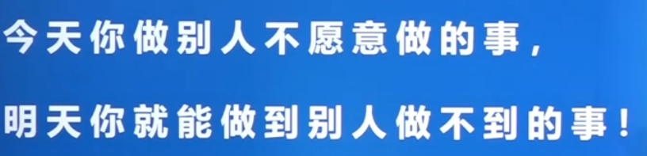

## 题型概览

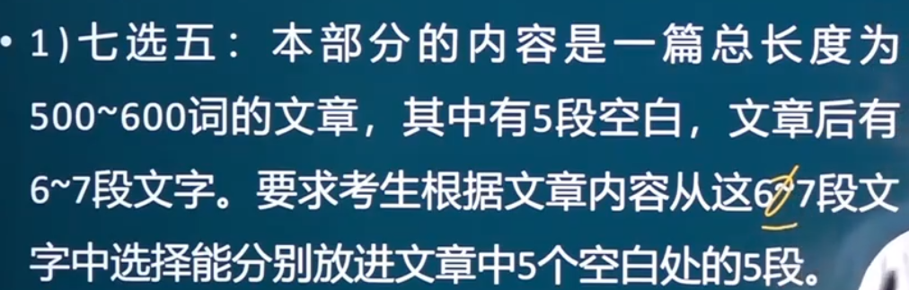

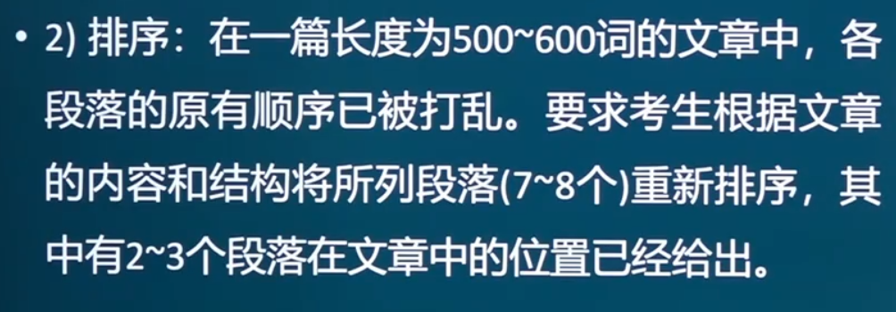

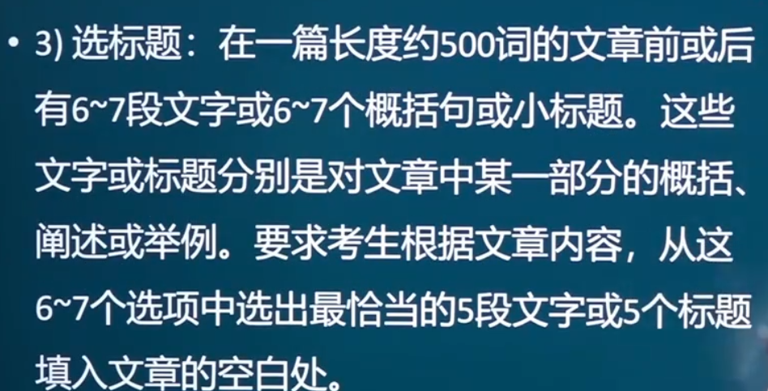

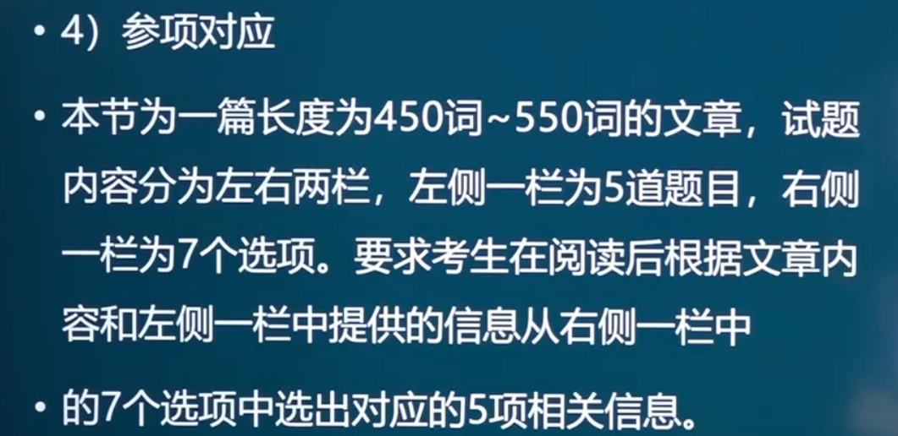

英一主要考七选五/排序/选标题，英二主要考选标题/参项对应

## 一、七选五

### 1.认识

主要考察上下文的逻辑分析能力

### 2.考点分析

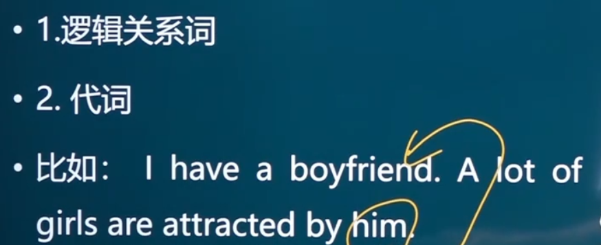

2的特例如强调句、主语从句

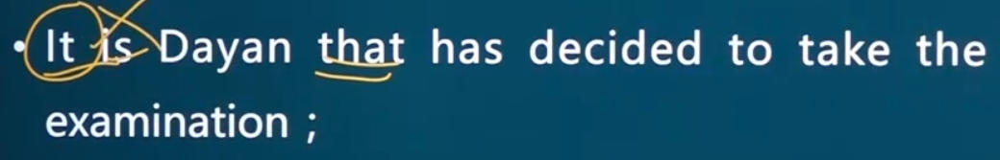

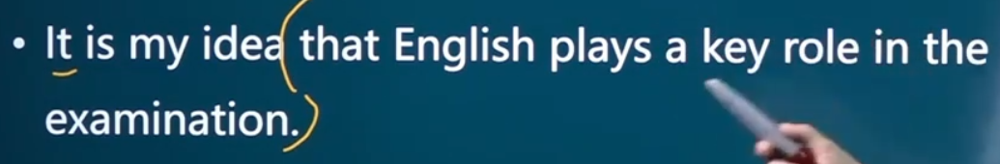

### 3.做题步骤

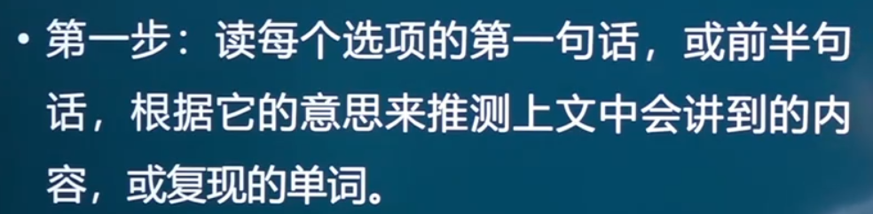

第二步，根据每个选项出现的位置，来确定读该选项的上一句还是下一句还是上下都读，然后根据这句话的意思来推测题目中很可能会讲到的内容，

如果这句话没读懂，题目中最可能出现的是这句话中的动词/名词。

第三步，确定选项，与上下文（上文/下文/上下文）是否彼此满足（双向满足），检查时再通读全文是否通顺

重点关注，此类后面的名词，指代上文已经提及的名词/专有名词等

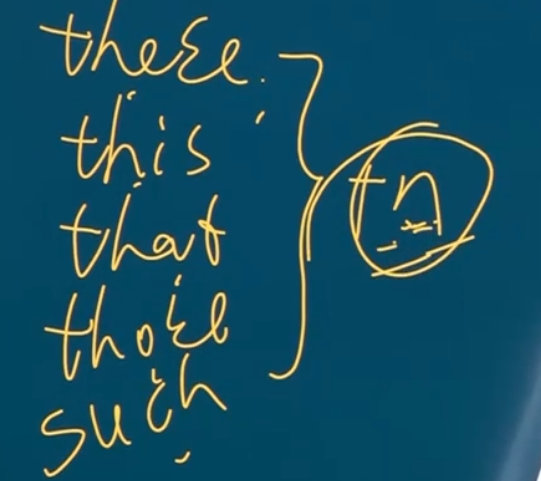

`一个选项中，带（更多）逻辑关系词的为正确选项`

## 二、排序

首先找出第一个选项最后一句的关键词，看哪几个选项中含有关键词，之后再根据双向满足原则

第二个选项要看，第三个给出选项的第一句中的关键词

同理第四个选项要看三个选项中的最后一句中的关键词

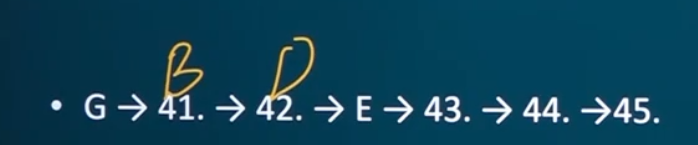

## 三、选标题

先读题干，根据选择下段落的中心选择

（送分题罢了）

## 四、参项对应（连线）

带着人名字及选项，逐一回归原文，寻找原文中出现的与选项匹配的

`一段中可能出现两个选项的答案`