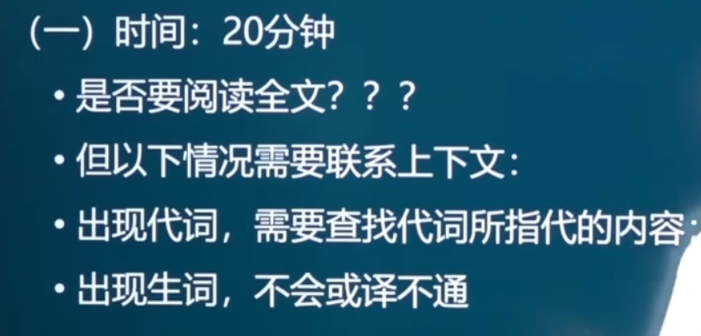
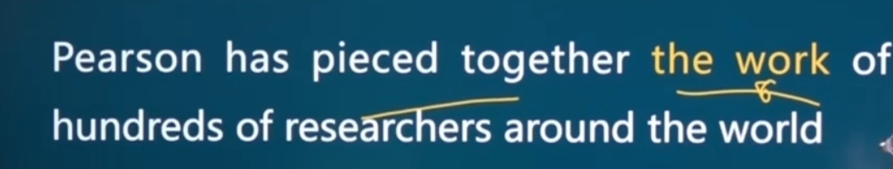

## 一、概述

### 大纲要求

### 评分标准

## 二、考点分析

`定语状语并列句`

### 1.考查内容

be exposed to 译为接触到/生活在…之下

### 2.翻译技巧

#### 词义的选择

完善的体系

细腻的皮肤

优雅的生活

`当汽车（排放尾气过量时）对环境造成危害时，污染检测器将会使汽车停止工作`

#### 词性转换

eg：我羡慕你决心与考试作斗争

#### 增词法

eg:麻辣烫对于重庆的旅客是一种必须的`小吃/美食`

…收集工作`成果`

#### 省略翻译

`以上技巧的核心目的是为了保证翻译的通顺与完整`

## 三、翻译方法概述

### 1.直译

热线

疯牛病

禽流感

五湖四海

### 2.意译

相亲（从未见面的男女经第三者安排所作的约会）

银河

西红柿（番茄）

倾盆大雨

### 3.音译（主要为专有名词）

可口可乐

汉堡包

沙发

达尔文

## 四、翻译的步骤

拆分依据为语法，拆分原则为句子主干与修饰成分（分清句子的结构、引导词、关系词、先行词等）

## 五、考点翻译方法

### 1.代词

如果指代的清除，则不需要查找代词所指代的内容

一致：语法和意思

把代词翻译成这/那

根据就近原则，themselves指代移民运动migration movements（而不是problems），译为现如今`这些移民运动`因为现代化的交通方式变得相对简单

### 2.专有名词

弗洛伊德

芝加哥

加利福尼亚

世界卫生组织

皮尔森

沃尔夫

直接汉语中写英文

### 3.被动

#### 普通句式

##### 顺译

问题`得以`解决

##### 倒译

他被你们打了——>你们打了他

eg:我们必须要采取有效的措施来阻止污染

#### 特殊句式

### 4.插入语

### 5.倒装

还原后再译（还原成正常语序）

### 6.定语

#### 识别

名词后的一坨（只要不是动词，且排除状语）

#### 翻译方法

修饰量不大时，把定语翻译在名词前；

当定语的成分比较复杂，信息量较大，采取拆开翻译的方法

这时，通常需要重复先行词或使用代词（他/她/它们）；

直接把定语的谓语翻译成句子的谓语，和先行词间构成主谓关系

前置

后置

融合

### 7.状语

#### 识别

参考九大状语从句及伴随状语

#### 翻译方法

### 8.同位语

方法同定语从句

### 9.省略

在长难句中，见到连词，通常出现省略，翻译时，先把省略的部分补充完整，再翻译

找成分的对应来补充省略的内容

达尔文认为失去了这些兴趣，不但失去了快乐，而且很可能对他的智商造成伤害，并且更可能对于道德品质造成伤害。

They可去上文找，it可翻译成这