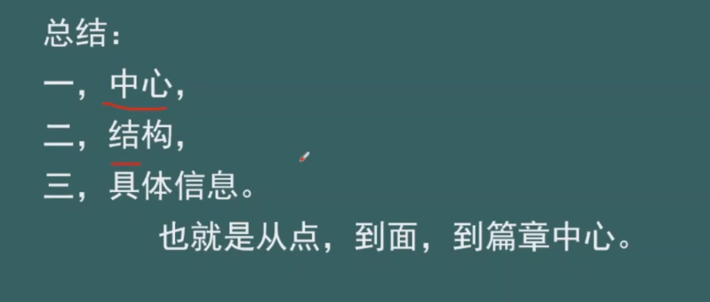
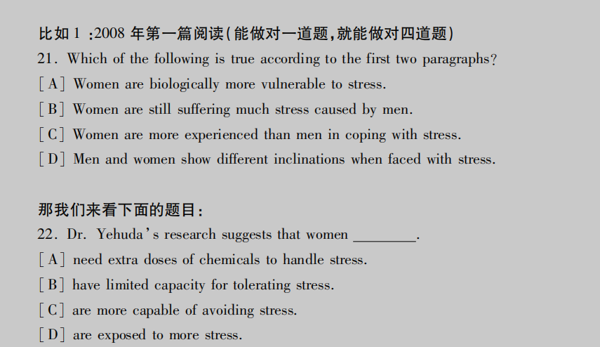
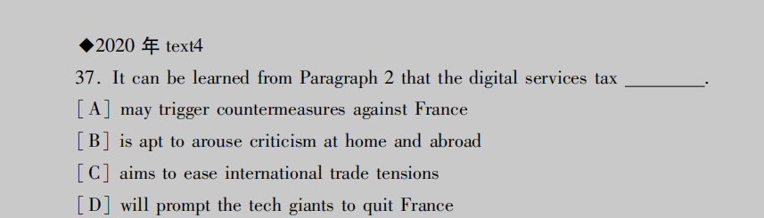
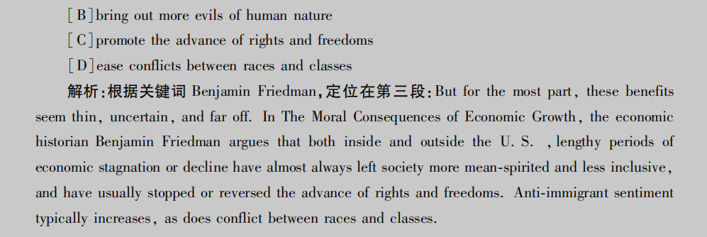
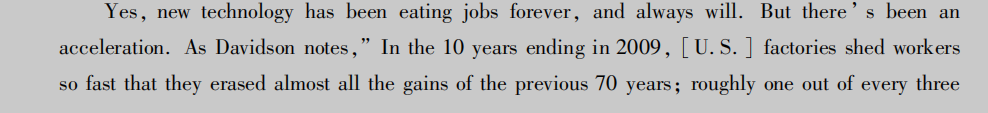
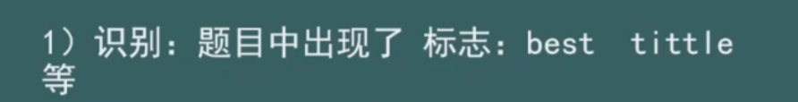
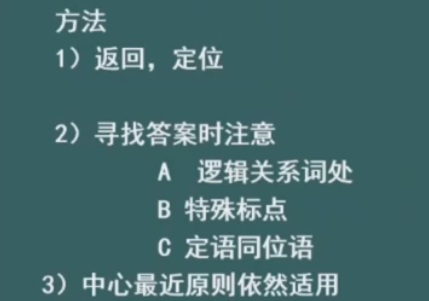
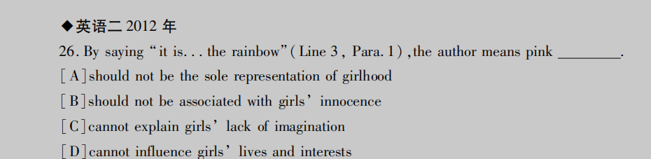

## 一、阅读概述

### 1.认识阅读

* 词汇
* 语法长难句
* 阅读能力（上下文逻辑分析能力）
* 方法

### 2.大纲要求

#### 1）时间要求及做题顺序

#### 2）具体要求

#### 3）总结

### 3.方法讲解

`习惯：读完题干，先看选项（翻译选项）再去原文定位`

## 二、出题点

### 1.文章的首段和尾段

`题干要求前两段中找使，答案大概率在第一段`

`如果答案在主句和从句中出现了分歧，应从主句中判断`

### 2.某段的段首和段尾句

### 3.举例处

### 4.引用处

C选项在文章中带双引号，且文章中使用like，所表达的意义不一致，即C肯定不选

D选项也带有双引号，不选

### 5.逻辑关系词处

`带有或许/可能 may、could字眼的选项大概率为答案`

### 6.特殊标点符号处

看表示转折的前/后，本题中

## 三、做题步骤

### 1.第一步

### 2.第二步

### 3.第三步

`胸怀大局，左顾右盼`

## 四、做题方法

### 1.细节题

#### 识别与解题思路

`在探讨具体做题方法之前，先吃透一篇文章（精读、能够有自己的见解、可以背诵部分句子/整篇）`

补充

`考察点都围绕着“女人的压力很大”，每篇文章通常存在两道统一倾向性的题`

补充代词指代题

### 2.推理题

#### 出题标志

#### 解题思路

### 3.例证题

#### 出题标志

#### 解题思路

### 4.主旨题

#### 识别

#### 解题思路

### 5.猜词句子意思题

#### 解题思路

### 6.作者态度题

#### 出题标志

#### 解题思路

## 总结

### 正确答案特点

### 错误答案特点

### 围观宏观做题法

