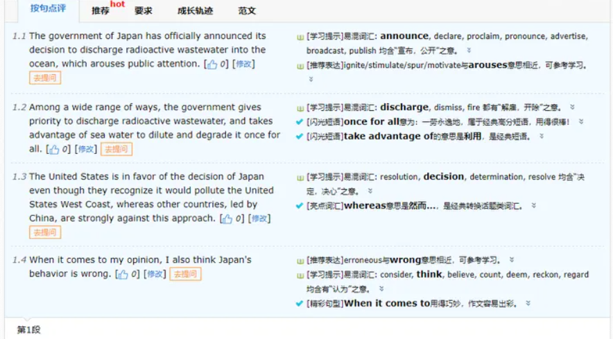
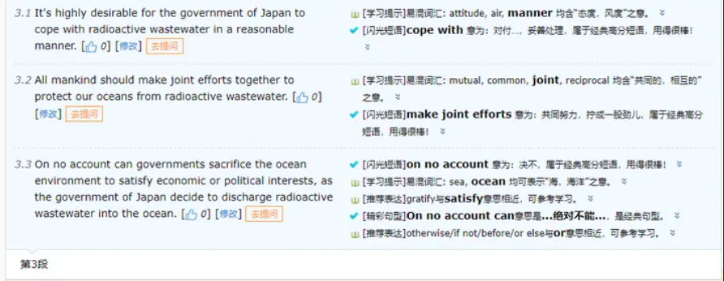

分为四部分，第一部分是我整理搜集的批改网判定的高分短语、句型（这些是可以加分的，尽可能多用），第二部分是我喜欢和常用的短语、句型（但是批改网不会判定为闪光），不仅在批改网可以用考试也可以用，最后是把我那些年写过的批改网贴上来造福大家，另外希望天堂没有批改网。最后更新了两篇我是如何把80+的作文修改到90+的（附【内容相关】项的感悟）（一定要看！）。

多年与批改网纠缠宝贵经验总结，仅供学习使用，欢迎点赞，禁止转载。

## **Part 1 批改网高分短语句型**

enjoy great prestige in the world 享誉世界

be the essence of 是……的精华

arouse public attention 引起公众关注

undoubtedly 毫无疑问

have a profound impact on both individuals and society 对个人和社会有深刻影响

needless to say 不必说

make efforts to 努力做

be occupied with 忙于做某事

work out 解决，实现

increase the awareness of the importance of 增强对……的认识

in addition to 除此之外

what's more 另外，而且

whereas 然而

nothing but 只有，只不过

take advantage of 利用

on account of 由于

far beyond 远远超出

may as well 最好，不妨

it pays to ……是值得的

not to mention 更不用说，别提

be of + n =adj

contribute to 有助于做……

be beneficial to 有利于，有益于

pay attention to sth 注意，重视

for all that 尽管，虽然

in a nutshell 简言之，概括地说

too…… to…… 太……而不能……

on no account (can) 绝不（能）

take into account 把……考虑进去

cope with 对付，妥善处理

once for all 一劳永逸地

give priority to 给……优先权

be short of 缺乏

attach great importance to 高度重视

enrich one's experience 增长见识

make joint efforts 共同努力

in terms of 根据

succeed in 成功做成某事

in the main 基本上，大体上

for certain 肯定地

with the result that 结果是

There is no denying that 不可否认的是

It is conceivable that 可想而知的是

the reason why ……的原因是……

It is universally acknowledged that 大家都认为

It goes without saying that 不用说

A case in point is 一个恰当的例子

An advantage of …… is that ……的优点是

cannot emphasize the importance of …… too much 怎么强调……的重要性也不为过

It's highly desirable for sb to do something 很希望某人做……

When it comes to 当谈到

## **Part 2 其他高级表达**

enjoy widespread popularity 受欢迎

enjoy a good reputation 有名

a wide range of 各种各样的

develop a preference for 喜欢

No one could have failed to notice the fact that……没有人不会注意到……这一事实

multiply the chance of 增加……的机会

There is no denying that 这是不可否认的

attach great importance to 认为……重要

give me a kind consideration 给我一个机会

on my way to…… 我在干……

be of great benefit to / be very beneficial to 有利于

contribute a lot to 大大地促成了

to begin with / to start with 第一

in addition / what's more 第二

last but not least 最后

单词/短语升级

and = along with

but = however

very = extremely

consider = take into consideration/ account

finally = eventually

hard-working = diligent

help = assist

should = be supposed to

understand = figure out/ make sense of

shortcoming= drawback

be busy with = be occupied with

important = vital

improssible = out of the question

interesting = absorbing/ stricking/ appealing

join = participate

meaningful = rewarding

be different from = differ/ vary from

be eager to do = be dying/long to

hard = challenging

adj = be of +抽象n: important = be of (great) importance

disappointed = depressed/ frustrated / be cast down

ignore = neglect /take no notice of /overlook /pass by

didn't take part in /attend = be absent from/ absence from

more and more +adj/adv = increasingly +adj/adv

more and more +n = an increasing number of/ a growing number of

all kinds /sorts of = a wide range of / a variety of

be famous/ be well known = acknowledeg oneself = enjoy/earn a good reputation

be popular with = appeal to / be attached to / enjoy widespread popularity

最后，高级语法总结为（我英语老师总结的）：

肯定不如否定好，主动不如被动巧。

定语从句用得妙，倒装分词不可少。

两个好用的倒装句：

Only in this way/ Only by this means can we ……

Not only can you……, but also you can……

比较简单的分词用法：现在分词作结果状语，状语从句省略中出现过去分词，过去分词作后置定语。

## **Part 3 几篇作文实例**

标黑的是系统判定的闪光短语和精彩句型，但我里面用到的高级短语和句型不止标黑的（我要我觉得，臭不要脸，只有第一篇用斜黑体标了一下后面太懒了）。

我都是学习几个固定的短语句型，然后形成比较固定的模板，写作文就往模板里套。都是三段式qwq~

**这是我在系统提交过的作文，可以借鉴模板但不要复制粘贴，会被查重判定抄袭。**

**It is universally acknowledged that** hospice care is a special kind of care that gives priority the quality of life for people and their caregivers who are experiencing an advanced, life-limiting illness. In recent years, hospice care ***enjoys widespread popularity\*** among citizens ***in that\*** it provides compassionate care for people in the last phase of incurable disease so that they may live as fully and comfortably as possible. Some people prefer palliative care while others make a choice of hospice care. ***When asked my view about it\****（一个简单的状语从句省略中出现过去分词，用于引出自己的想法非常好用）*, I would ***take\*** hospice care ***into consideration\***.

***First and foremost, it is generally acknowledged that\*** hospice care treats the person and symptoms of the disease, rather than treating the disease itself. Palliative care, ***nevertheless,\*** usually is a part of hospice care. The main goal of including palliative care into hospice services ***attaches importance to\*** ***assist\*** patients to be comfortable while allowing them to enjoy the last stage of life. **What's more, the reason why** I recommend hospice care is it ***contributes to\*** the patients, ***therefore,\*** their last days which may be spent with dignity and quality, surrounded by their loved ones. What hospice care brings is a quality life, making the best of each day during the last stages of advanced illness. *Not only can* hospice care **cope with** physical issues, ***but also it can\*** focus on mental, emotional, social, and spiritual issues that may come up.

Just as the saying goes, you matter because of who you are, and you matter to the moment of your life. **There is no denying that** hospice care will ***arouse more public attention\*** with the economic and social development progress.

Research ethics is characterized as guidelines and norms followed when conducting academic research. In recent years, research ethics have attracted an increasing number of attention from academia and society. When asked my view about it, I suppose research ethics plays an essential role in scientific research.

First and foremost, it is generally acknowledged that research ethics is the most basic requirement of any academic. Therefore, academic misconduct cannot be accepted and tolerated by a large number of scientific researchers. **A case in point** is He Haibo, an associate professor of Zhejiang University, was sacked and fired for plagiarism, and his tutor who enjoyed a good reputation in the field of medicine, was involved in the scandal. **What's more,** maintaining research ethics not only is of great importance to scientific research activities, but also is very beneficial to promote a truth-seeking social atmosphere as well as improving the moral level of the society.

Due to the necessity of research ethics, **it is conceivable that** a variety of effective measures must be taken as to purify the scientific research environment. Research ethics should be taken as the foundation in the personality training to attach great importance to the consistency of quality, action and research. Furthermore, **there is no denying that** establishing the [inne](https://www.zhihu.com/search?q=inne&search_source=Entity&hybrid_search_source=Entity&hybrid_search_extra={"sourceType"%3A"answer"%2C"sourceId"%3A1603776121})r and out supervision system will contribute to **coping with** misconduct.

As is vividly depicted in the cartoon above, the delivery is forbidden to enter the campus while the student is anxiously waiting for his takeaway. The entire picture reveals the sharp reality whether takeaway should be forbidden to enter the campus.

With the popularity of the mobile Internet, takeaway enjoys widespread popularity in that it is convenient, fast and affordable. **What's more,** the taste and service quality of takeaway are better than the food made by the canteen; therefore, an increasing number of students develop a preference for ordering takeaway. Eventually, saving time for students who **are occupied with** learning makes takeaway more alternative.

In contrast, there are three hidden drawbacks in the takeaway, making school rules prohibit delivering takeaway. First and foremost, there are food safety hazards in takeaway. In the second place, ordering takeaway frequently is not beneficial to forming a wholesome diet and diligent habit. Ultimately, delivering takeaway leads to the chaotic disorder on campus.

As far as I am concerned, the school is supposed to strengthen guidance rather than ban the delivery from delivering takeaways. The school should attach great importance to improve the quality of canteen dining. Strengthen the management of the sale and control the hidden dangers of health and safety should also be **taken into account**. Only in this way can students have more alternatives.

**下面三篇作文里好像还有些错，但是我很懒当时就没改,现在也很懒……**

**可以略过不看，发现错误可以提醒我哈哈哈**

**但是也可以学一下里面分号的用法。**

Part time jobs enjoy widespread popularity among the group of college students nowadays. Different individuals hold a wide range of views. When asked my opinion, I support college students to participate in part time jobs in that it has the following three merits.

First and foremost, doing part time jobs offers you an opportunity to make an attempt to contact the society, improving your practical ability and expanding your horizons. What's more, doing part time jobs is of great benefit to your development since you can make sense of rewarding knowledge. Last but not least, no one could have failed to notice the fact that you can earn a large amount of pocket money in your spare time provided that you are diligent enough.

In conclusion, an increasing number of college students develop a preference for doing part time jobs owing to it contributes a lot to our development; therefore, college students are supposed to do part time jobs. Only in this way can we have a more appealing life.

How are things going with you?

As you know, I joined an online language course a few months ago. I'm writing to recommend the course and give you some advice on how to improve language ability effectively.

In our class, the teachers systematically explain language knowledge, which is the most vital cause why I recommend you to participate in our course. Varying from the traditional class, our class atmosphere is truly relaxing and appealing; therefore, both teachers and classmates can be close friends who can do you a favor. Besides, we are asked to speak in English regardless of the class time or spare time, which can multiply the opportunity of getting in touch with English.

On your way to learning language, I'd like to share my advice with you. Firstly, doing a large number of exercises is of great benefit to your learning. **What's more,** you can turn to the website where you can find plenty of information related to how to learn English well. Eventually, you can go to the English corner to communicate with others.

Looking forward to your early reply.

I'm lacking in words to describe how regretful I am when I write this email to you. I have participated in your online language course since a few months. I'm writing to tell you I can't go on your course and I'll say what I think about it.

The basic reason why I choose to quit is that I am **too** busy **to** have time to accomplish it. Your course is of great benefit to my advancement in English language, however, my spare time is occupied by a growing number of professional classes. To make things worse, I require going out for an internship this year. In consequence, it's a pity that I won't continue.

Overall, your course is fairly satisfactory, since the teachers interpret systematically and class atmosphere is truly appealing. Particularly, another advantage of the course is that it guides me to use English as much as I can in daily life. **Whereas,** I consider this course still exist some insignificance. As an illustration, with regard to fragmented learning gains its popularity in the youth group, I think you **may as well** attach importance to this field. In this case, although I don't have plenty of time, I can still acquire a little English language every day with piecemeal time.

So apologetic am I. And it's highly desirable for you to understand me.

## **Part 4 修改作文实例**

### **内含：内容相关+篇章结构的感悟**

**例1：我是如何通过修改一个单词将作文的分数从86.5分提高到91分的？**

在批改网的评分标准中有很重要的一项是**内容相关**。要做到这一点也很简单，就是**关键词复现**。

刚刚我写了一篇有关慕课（MOOCs）的作文，修改完毕只有86.5分，我以为90+无望了，但是抱着试一试的心态，把最后一句“Not only can it……, but also it can ……”中的第一个it替换成了关键词MOOCs，一下子就多了4.5分！

可以看到内容相关确实涨了一大块。

与主题有关的关键词一定要在文中反复出现，这样系统就会判定内容相关度高，而其他的词语为了变化增加可读性可以进行同义替换。

比如在第一段中，表达观点我就用了三种不同的表达方式，所以不要再呆呆地用I think/ recognize了~

持某观点：claim = contend/ deem/ assert/ share the belief that/ hold the view that

支持某观点： advocate = maitain/ vote for/ side with/ be in favor of

反对某观点： contradict = criticize/ be against/ cast doubts on

把原文贴上叭~老规矩加粗的是批改网加分精彩句型，斜体是我自己的推荐用法。

**It is universally acknowledged that** MOOCs *enjoys widespread popularity* among students in recent years in that it is convenient and efficient. Some individuals share the belief that MOOCs, *as a burgeoning means of learning*, will replace offline teaching in campus, *while* others side with MOOCs are just a fad which will fade away as time goes on. *When asked my opinion about it*, I'm not **identify with** the two views above and hold the view that MOOCs and offline teaching will not disappear or **out of date**.

First and foremost, **the reason why** *an increasing number of* students *develop a preference for* MOOCs is that it's time-saving and convenient, making course get rid of the limitation of time and space. **What's more**, another advantage of MOOCs is that we can *access* *a wide range of* knowledge, *which* *contributes to* expanding our horizons and enriching our experience. **Whereas**, **there is no doubt that** MOOCs is suffering from the disadvantages that teachers from students are devoid of face-to-face communication with each other in comparison with traditional offline teaching. On the one hand, the feedback received by teachers from students is not timely and sufficient. On the other hand, some students with poor self-control may relax due to the lack of supervision of a digital campus.

**In a nutshell**, MOOCs will promote the integrated development of online and offline education. *Not only can MOOCs* improve teacher's work efficiency, *but also it can* satisfy the a variety of needs of students.

另外，**篇章结构**是与文中用的连词、转折词有关的。

比如：

first and foremost, to begin with, to start with (第一）

**what's more**, in addition （第二）

last but not least, eventually （最后）

**In a nutshell**, to sum up, in conclusion/ summary （总结）

however (but可以用however替代，但but用在一句话内，however是另起一句话再用，另外，however用在句首不是很地道，可以主语+，+however+，+剩下的句子）

while （表示转折和两者对比时很好用，比如一部分人认为……，while另一部分人认为……）

whereas （然而）

**例2：通过最后一段的关键词复现将作文的分数从88.5分提高到90.5分。**

依旧是内容相关。

今晚写了一篇作文，用了好多闪光短语，根据批改网提示改完错误之后也只有88.5分，以为无缘90分了，但依然决定从内容相关入手，把第一段用过的表述重新在最后一段加了一下，结果UP了两分！

这是一篇对【日本福岛核电站向太平洋排放核废水】分析和看法的作文。

作文开头如下：

原结尾：

大意是我们都期望日本政府可以通过合理的方式妥善处理放射性污水。全人类都应该共同努力保护我们的海洋。各国政府绝不能牺牲环境来满足经济或政治利益。

检查全文后，确实最后一段的内容相关度有些低，我就很简单粗暴地把第一段的ocean、radioactive wastewater、Japan decide to discharge radioactive wastewater into the ocean给融入了一下。

修改后大意如下（加粗表示增添的部分）：我们都期望日本政府可以通过合理的方式妥善处理放射性污水。全人类都应该共同努力保护我们的海洋**免受放射性污水的危害**。各国政府绝不能**像日本政府决定向海洋中倾倒放射性污水那样，**牺牲**海洋**环境来满足经济或政治利益。

撒花~

作文原文（是完全按照我上面说的几部分书写的，依然是三段式，闪光短语+句型加黑）：

The government of Japan has officially announced its decision to discharge radioactive wastewater into the ocean, **which arouses public attention**. Among a wide range of ways, the government **gives priority to** discharge radioactive wastewater, and **takes advantage of** sea water to dilute and degrade it **once for all**. The United States is in favor of the decision of Japan even though they recognize it would pollute the United States West Coast, **whereas** other countries, led by China, are strongly against this approach. **When it comes to** my opinion, I also think Japan's behavior is wrong.

On the one hand, the reason why the government of Japan chooses this way is economical and convenient. **Besides,** Japan and the United States **take** political games **into account**. On the other hand, the government's handling of radioactive wastewater is irresponsible. **It is universally acknowledged that** world ocean is connected, **with the result that** the pollution will spread to all the seas, as well as all human beings will bear the consequences.

**It's highly desirable for** the government of Japan **to cope with** radioactive wastewater in a reasonable manner. All mankind should **make joint efforts** together to protect our oceans from radioactive wastewater. **On no account can** governments sacrifice the ocean environment to satisfy economic or political interests, as the government of Japan decide to discharge radioactive wastewater into the ocean.

批改网按句点评：

------

## 更新：一篇范文+CNKI翻译助手翻译学术词汇

这次的作文题目比较学术，只好借用CNKI翻译助手了，这个网站也是我读英文文献查找专业释义的常用网站。

[CNKI翻译助手dict.cnki.net/index](https://link.zhihu.com/?target=https%3A//dict.cnki.net/index)

然后风暴潮灾害（storm surge disaster）这个专业术语，不管采用哪种翻译，批改网总以为它是错误的（我也不知道怎么改了QAQ），总是说我主谓不一致。

最后就只好出卖自己了……

还有一处改不出来了，我累了，就这样吧，聪明的孩子你们可以告诉我吗QAQ

因为这次风暴潮灾害反复出现，所以内容相关度很高~

原文：

Storm surge is a phenomenon of abnormal increase of sea surface caused by strong atmospheric disturbance which usually includes tropical storms, extratropical cyclone, cold waves or cold air. Storm surges disaster usually refers to the disaster caused by the storm water increase anomaly and its influence factors coupled with the high tide level, with the result that leads to casualties and property losses.

**It is universally acknowledged that** storm surge disasters occur frequently in China. **When it comes to** the measures to **cope with** storm surge disaster, it can be carried out from the following aspects. To begin with, the National Forecast Center should make efforts to form a complete observation and prediction network of storm surge disasters, to improve the ability of storm surges disaster early warning and perfect the storm surges disaster emergency plan system and the response mechanism. **What's more, it pays to** build coastal protection projects, raise seawalls and other defense standards in key protected areas, and build sustainable ecological defense measures such as biological revetment engineering. Last but not least, we will strengthen Marine and coastal ecological protection mechanisms and enhance the climate resilience of Marine and coastal ecosystems.

Under the background of global warming, the frequency, intensity and occurrence time span of storm surge disaster in coastal areas of China has increased to a certain extent. It's highly desirable for government and research institutions to **make joint efforts** in order to work out storm surges disaster.

这个我真不行了hhh

## 更新：论文翻译APP+如何入门读英文文献

推荐一下自己的新回答：

连接词 大家都知道 但是 过程性词汇 又是什么？

为此 我又找到了 一份论文 资料 （真的是第一次看论文啊 有点紧张）

里面对于过程性词汇的列举是这样的

我自己在扇贝上学习的连接词

这是一些亮点词，大家可以百度搜索其他的

相信很多朋友 包括我 其实也不懂哈哈哈 如果有朋友知道，可以在评论区留言哦

那么我就用我的理解告诉大家。

首先，（**内容相关**）写作文之前，你要不停的告诉自己，不能偏题，不能偏题，不能偏题。同时写的时候，要上一句接下一句，最好下一句有与上一句相关的词汇，或者就直接出现上一句出现过的词汇。因为这样机器才会知道，你这两句是相关的。尽量写的越多越好。（**篇章结构**）每段前面最好有Firstly，secondly等等这些有层次的词语（**句子**）写完之后，然后把其中的句子能合并的，全部都合并起来！全都改成从句，能不要简单句就不要！（**词汇**）看一看你使用的词汇，一个字一个字看，到网上查查更高级的近义词换掉，在词汇前加高级的形容词。什么闪光短语，闪光词汇往里加！题目里面有的词语都往里加！

这时候，如果你能完美的执行我以上的建议，那么你的分数应该已经达到90以上了。并且你的评语应该显示如下。评语或者分数没达到标准，那请继续修改哦。

最后就是，技巧分享了，让95以上的同学再提高。我知道大家可能对批改网有意见，毕竟人家是个机器人，没有感情，批改作文一板一眼。但是如果你的作文没有达到90分，我认为可能更大的原因，是你需要再练习写作。

如果达到了，那很好，开始分享。

你可能改了无数次

，每次提交都带着期盼与遐想，

可是几十次提交，还是这个分数，甚至降低了，打击了积极性。Deadline前最后一天，我很想放弃，不改了。可是我很感谢 我的老师 一直鼓励，还有一起参加比赛的同学，相互鼓励 相互分享技巧，还要感谢我自己，每次失望后，我都告诉自己 我不服！我的作文肯定是高质量的！最终我获得如愿分数。那种喜悦，那种复出后有回报的感觉，真的很棒！

1. 删掉多余的句子，删掉简单句，提高信息密度（因为批改网可以无限次提交，备份好原件，删一句看一次分数，如果升高了，恭喜。如果降了，赶紧粘贴回去。我从600字删到300字）
2. 多用过渡性词语，连接词（无脑加，不管他娘的意思，先每段前面加一个，firstly，secondly等等。如果提高了，每句话前面都加！如果加了几个发现分数没变，那可能在篇章结构的分数都得满了）
3. 注意文章结构的分配，每段的字数最好不要差太多，如果有某一段句子少，可以直接连到上一段去。
4. 最后就是玄学 内容相关，多研究题目和题干，作文里加入思想类似的句子（管他娘的，直接标题，题干复制几句话到作文里，我98.5到99就这么来的！）

祝愿大家都能得到自己满意的成绩！分享我的喜悦！