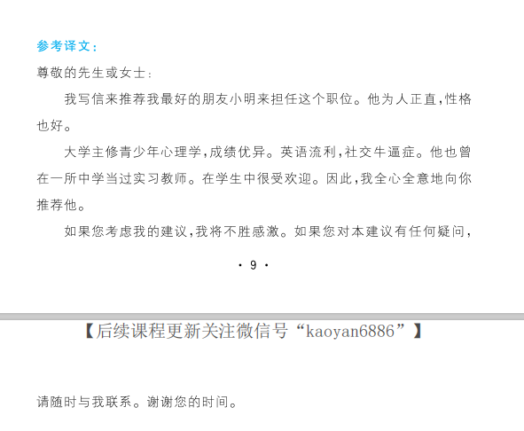
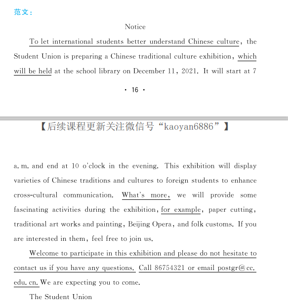

## 一、历年真题

### 小作文

### 大作文

## 二、小作文预测

### 1.建议信

### 2.咨询信

### 3.投诉信

### 4.道歉信

### 5.通知

### 6.建议信

### 7.感谢信

### 8.纪要

## 三、大作文预测

### 1.心理健康

### 2.网购

### 3.诚信

### 4.团结合作

### 5.旅游人数

### 6.城市化

### 7.受教育程度与失业率

### 8.人口老龄化

### 9.终身学习（材料/文字）

## 四、常用表达

