作文升华核心：

`适度使用过渡短语及从句（名词性/状语/定语）；从句中穿插固定搭配；适度使用名言警句`

## 一、过渡短语

### 1.开头

首先：

* First and foremost

* To start/begin with

广而言之

* In a broad sense

简单地讲

* To put it simply

广泛公认地

* As is universally acknowledged

众所周知

* As is known to all/well known

### 2.中间常用

此外：

* Furthermore
* Moreover /What’s more 
* Additionally/In addition
* Besides
* Apart from that


同时：

* Simultaneously
* Meanwhile
* In the meantime
* At the same time


然而(尽管如此)

* Notwithstanding

* Nevertheless
* Nonetheless
* However


因此

* Consequently /As a consequence
* Hence
* Therefore/Thus


其后,随后,接着

* Subsequently
* Whereafter
* Afterwards

由于

* Due to
* Owing to
* Thanks to
* As a consequence of


在我看来

* On a personal note
* As far as I’m concerned
* From where I stand
* From my perspective
* In my view


换句话说

* In other words
* To put it another way
* Namely


一方面......另一方面

* On the one hand......On the other hand
* For one thing...For another


事实上（实际上）

* Virtually
* As a matter of factually
* In reality
* Actually

例如

* For instance


更重要的是

* More significantly
* More importantly


普遍地(一般来说/通常/大体上/总的来说)

* Broadly/Generally speaking
* On the whole
* In general
* In summary


从...角度

* In terms of 


毕竟

* After all

  

与此相反

* Conversely
* Contrarily
* On the contrary


根本地;彻底地;完全地

* Radically
* Once and for all


最后(终)

* Last but not least(最后但同样重要)

* Ultimately
* Eventually

### 3.结尾常用

总而言之（简言之/总之）

* In conclusion /To conclude
* To sum up
* On all accounts
* In a word

综上所述

* As is mentioned above


简言之

* In brief / Briefly
* In short


首要的是，尤其

* Above all


坦白（地）说

* To be frank
* Frankly speaking


无论如何（不管怎样）

* Anyway
* In one way or another
* In any case


 

## 二、固定搭配


### 短语

be immersed in 陷入

most often 往往

be endowed with 具有

judging from this 由此看来

be synonymous with 与...相同/似

take advantage of 利用

be originated from  起源于

trace back to 追溯到

be obliged to do  有义务/不得不

make a bid for  争取

embark on 开始/着手做

be doomed to do  注定做

be in urgent need of doing  急需做

think highly of  重视

have a stake in  与...有关

have no stake in  与...无关

hinge on  取决于

strain to do  竭尽全力

in the event of  万一；倘若

triumph over  克服；战胜

get/be accustomed to  习惯于

spare no effort to do   不遗余力地

peg away at/hang on to/persevere in  坚持

various/diverse/A variety/diversity of/assorted  各种各样的

be destined for  以...为目的

That's to say  即；换句话说（也就是说，可放句中做插入语）

be likely to do 可能做

resist doing  拒绝/反对

on condition that 若是/以...为条件

in no circumstances  绝不（放在句首用半倒装）

attach great significance to  认为...重要

for the sake of   为了...(起见/的利益)

has a huge impact on 对…有巨大影响

with graceful manners 彬彬有礼

a deal is a deal (交易就是交易：一言为定)

from scratch 从头/零开始

in harmony with 协调一致;与...相合（常用于句中be动词之后 如What he said is in harmony with me.）

As is mentioned above综上所述

Judging from this 由此看来

be proficient in/have a good command of 精通(熟练)
      be synonymous with与…相同/近似

### 句子

Only in this way/when....＋can/will could sb. do

A wealth of reasons cast light on this phenomenon 许多原因阐明了关于这种现象

It’s beyond all doubt that这绝对毋庸置疑

It’s obvious that 显而易见

I deem it is advisable to do so because 我认为如此行事是明智的因为

What matters mosts to sb is that对某人而言最为重要的是

There’s no longer any way to deny that...已成实时，不容否定

The forms and styles are various and changing.形式和风格丰富多彩、推陈出新

I would appreciate it if you could take my suggestions/recommendations into account at your earliest convenience.

Looking forward to your reply. 如果您能尽早考虑我的建议，我将不胜感激。期待您的答复。

 

It's beyond all doubt that “A body without knowledge is like a house without foundation”，which （definitely） demonstrates/clarifies the significance of knowledge.（灵活运用）


## 三、名言警句(谚语)

1.Ten men banded together in love can do what ten thousand separately would fail in.（Thomas Carlyle）

以爱心聚在一起的十个人能够完成一万个分散的人做不到的事情（托马斯·卡莱尔）

2.Life is like a box of chocolates. You never know what you are going to get.

生活就像一盒巧克力，你永远不知道你会得到什么。（做一件事，不要听别人说难与否，需要自己去尝试） 

3.Each coin has two sides.

事物具有两面性。

4.Better late than never. 

迟做总比不做好

5.Practice makes perfect. 

熟能生巧。

6.Make hay while the sun shines. 

晒草要趁太阳好。(抓紧时机)

7.Knowledge is power. 

知识就是力量。

Wisdom is better than gold or silver.

知识胜过金银。

8.Strike while the iron is hot. 

趁热打铁。

9.When an opportunity is neglected, it never comes back to you. 

机不可失，时不再来。

10.All time is no time when it is past. 

光阴一去不复返。

## 四、词汇替换（高级词汇）

### 1.词汇替换

many -> a myriad of 许多，大量

very bad ->egregious 极坏的

beautiful -> resplendent 辉煌的，华丽灿烂的

wrong->erroneous 错误的


1. want(想) → intend to

2. famous(著名的)→well-known；outstanding

3. important(重要的) →crucial；significant；essential

4. remember(记得)→ bear in mind that

5. cause(导致)→contribute to；give rise to；lead to；result in

6. helpful(有用的)→ beneficial; rewarding

7. many(许多)→numerous；a number of; quite a few

8. beautiful(美丽的) →attractive；eye-catching；appealing；charming

9. improve(提高)→enhance；promote；strengthen

10. finish (完成) → complete；fulfill；accomplish；achieve

11. serious(严重的)→severe

12. develop (发展，培养 )→cultivate；nurture

13. keep (保持)→ preserve；maintain；hold

14. solve (解决)→resolve；settle；cope with；deal with

15. cheap(便宜的)→economical；inexpensive

16. difficult(困难的)→challenging

17. job(工作)→ career；profession

18. because(因为)→ due to；in that；for the reason that；now that

19. very(非常)→extremely；highly；profoundly

20. happy(高兴的)→delighted；pleased

21. clever(聪明的)→brilliant；intelligent

22. bad(不好的)→ awful; terrible

23. only(仅仅)→ merely; barely

24. so (因此)→ therefore；consequently；as a result

25. and(和)→as well as；along with；in addition

26. clear(明显的)→obvious；apparent；evident

27. meeting(会议)→conference

28. problem(问题)→issue；dilemma

29. happen(发生)→occur；take place；come about

30. show(显示)→indicate; reveal

31. get(得到)→acquire；attain；obtain；gain

32. think of sth.(想到) → sth. occur to sb.

33. in fact(事实上)→as a matter of fact

34. usually(通常地)→more often than not

35. join(参加)→take part in; participate in

36. thank(感谢)→appreciate

37. consider(考虑)→take account of

38. ignore(忽视)→neglect; pay no attention to

39. like(喜欢)→be fond of; be keen on; be attached to

 40.very(非常)→terribly；extremely；surprisingly；pretty；highly；badly；quite；simply；perfectly；totally

41. good(棒)→ great / wonderful；excellent；fantastic；brilliant；fabulous；superb；terrific；meaningful；educational

41. beautiful(漂亮的)→ attractive；appealing；fascinating；eye-catching；gorgeous

43. surprising(不可思议的 )→ amazing；extraordinary；miraculous

44. important(重要的)→ significant；essential；crucial ；critical；indispensible；decisive；dominant；predominant；determinant

45. big(庞大的)→ enormous；tremendous；gigantic；vast；boundless

### 2.高级词汇

#### adv

comprehensively  全面地

authentically/veritably/genuinely 真正地

exclusively 专门地，特有地

considerably 相当，非常

invariably 始终不变地，总是

increasingly 日益，越来越多地

presumably 大概，可能，据推测

simultaneously 同时发生地

spontaneously 自发/然地,不由自主地

virtually 事实上，实际地

triumphantly  (欣喜)胜利地，成功地

somewhat 稍微, 有点, 达到某种程度

outwardly 表面上，外表上地

optimistically 乐观地

intentionally 有意地，故意地

inevitably 必然地，不可避免地

formerly 原先地，以前，从前

explicitly 明确地

forcibly 强行地，有力地

deliberately 深思熟虑地，审慎地，故意地

#### adj

prosperous 成功的，繁荣的

magnificent 壮丽的，宏伟的，令人印象深刻的

ardent 热心的；热情洋溢的

cozy 舒适的，惬意的

radiant 容光焕发的；光辉灿烂的

detached 超然的；冷漠的；客观的（公正的）

terrific  极大的, 非常的；极好的，了不起的,；可怕的, 恐怖的, 骇人的

gorgeous 华丽的；极好的；令人愉悦的

agreeable 令人愉悦的；惬意的

gracious 亲切/和蔼的，高尚的；雅致的

adorable 可爱的，值得崇拜的

## 五、优秀表达及事例

### 表达

1.主语从句的满分表达就是it作形式主语:

It is common knowledge that...………是一个常识。

It is my belief that...= I think that...我认为……

It is self-evident that..……是显而易见的。

It has been found that...人们已经发现……

It is beyond dispute that..……是毋庸置疑的。

人们普遍认为/众所周知……

It is universally acknowledged that...

It has been widely accepted that..

It is generally agreed that...

2.从句中套从句

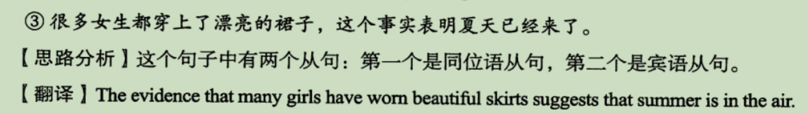

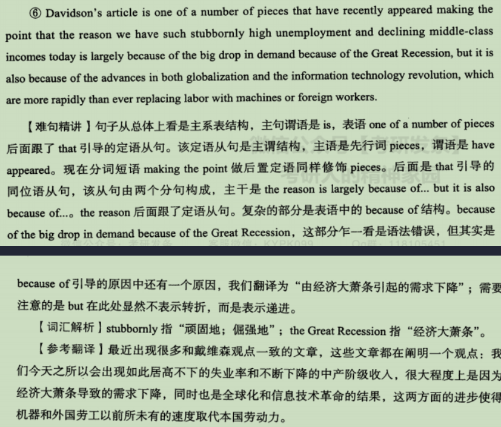

3.定从

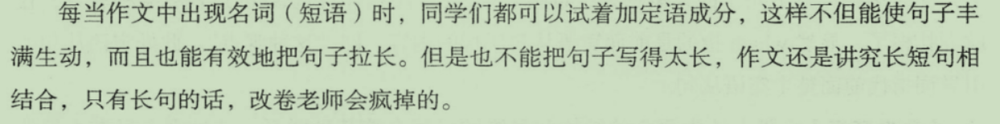

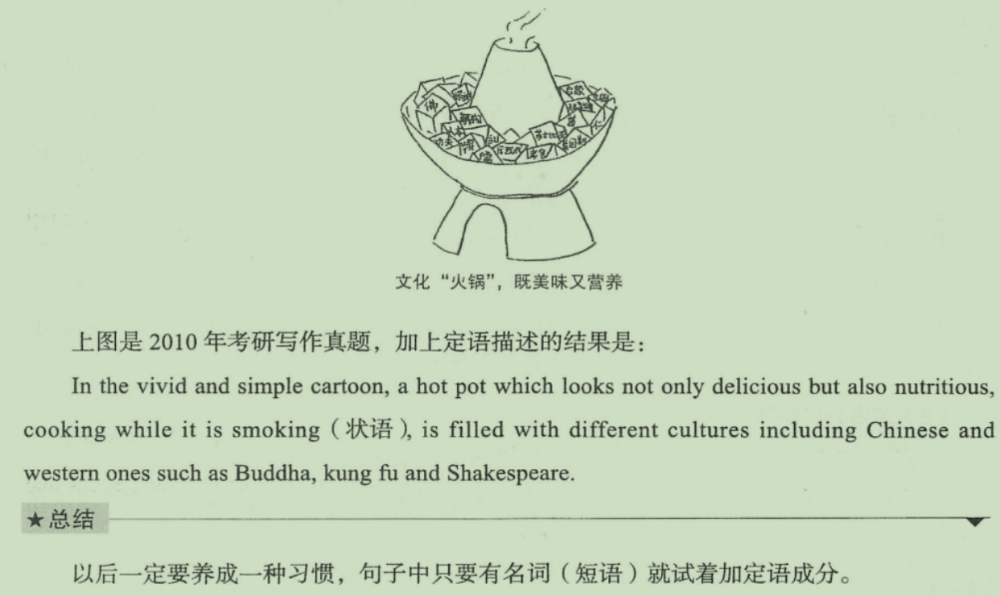

4.状语从句

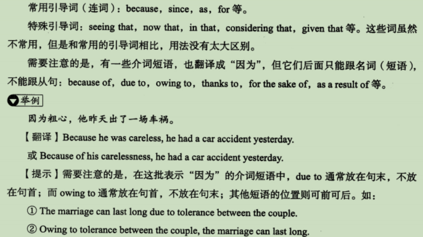

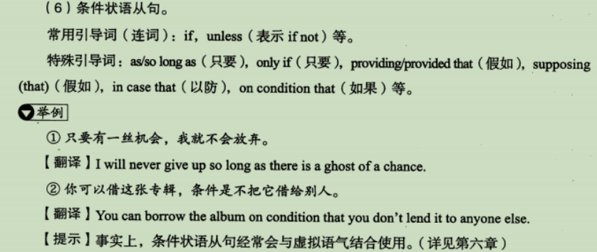

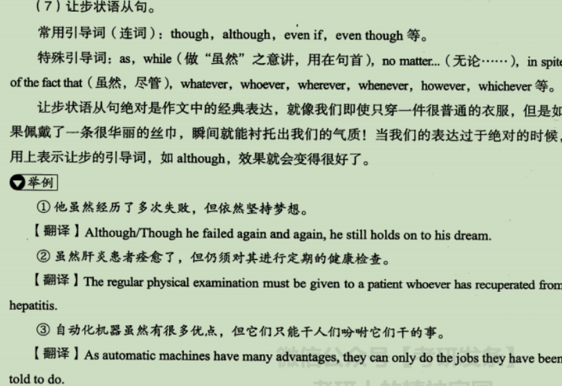

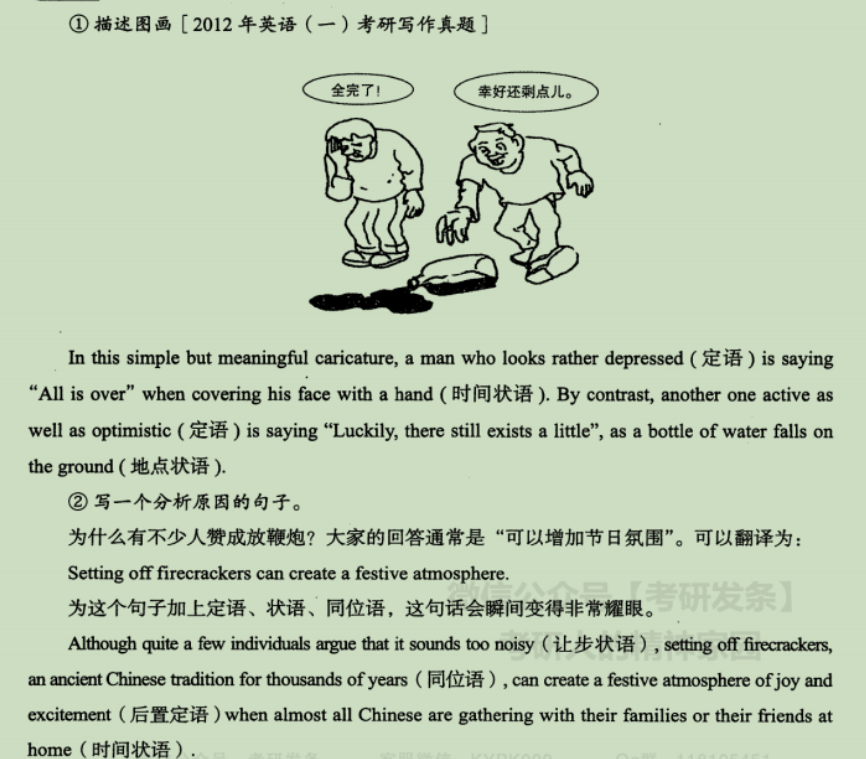

5.虚拟

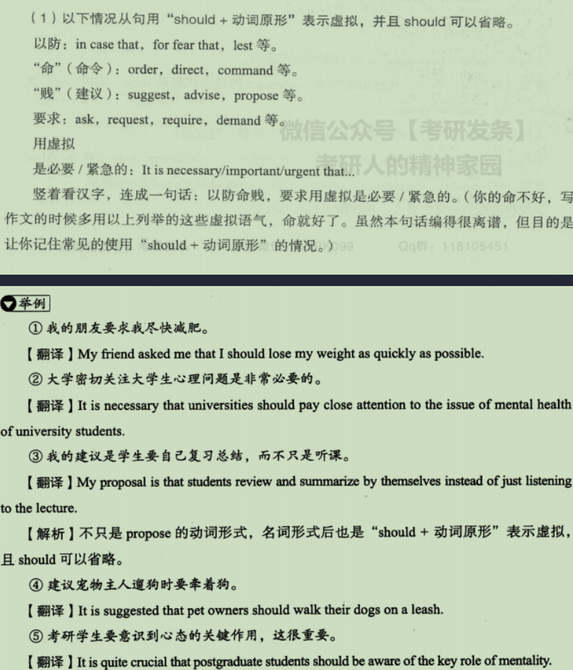

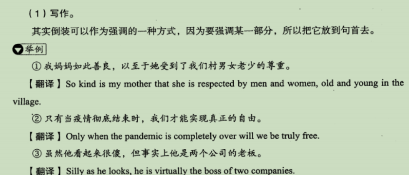

`写作有三宝，虚拟倒装强调好`

6.插入语

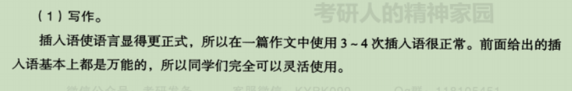

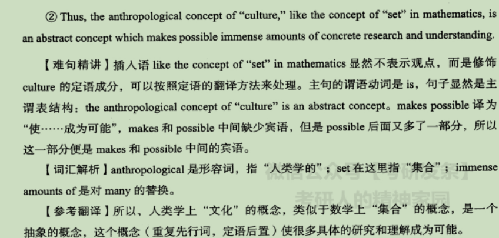

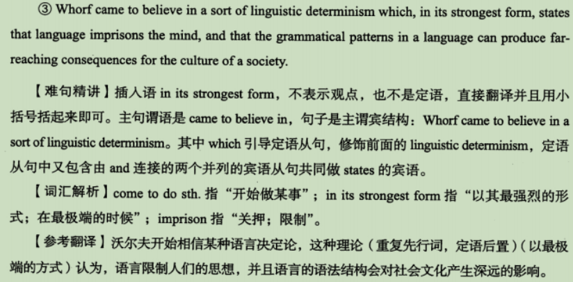

### 事例

1.After the devastating earthquake hit Sichuan Province,people across whole country made united efforts to reconstruct the stricken area and rebuild the confidence of people suffering the disaster.(当四川发生破坏性地震后，全国人民团结起来重建灾区，重塑灾区人民的信心。)

## 综述

```
1.习惯使用同位语（从句）/非限制性定从/非谓语过渡/ 结果/目的/让步状语从句等

2.适当使用虚拟语气（常规虚拟/错综时间条件/It is high time that +sb should do /did）、
倒装（Only in this way will/Only with hard work can you/Only when; So excited was he that he can't help laughing at midnight ）、
强调句(It is ...that) It is to account for the phenomenon that there exist numerous factors here.有很多因素可以解释这一现象
3.灵活表达：
常规单词使用固定搭配替换（use->take advantage of、many->a variety of）；
句子使用主语从句（形式主语）/动名词/不定式做主语/with +名词后置定语

4.适当使用谚语、高级新颖词汇(习惯用副词修饰)
As the proverb says,'Nothing is impossible to a willing heart'.
big->tremendous/enormous 巨大的 ;extremely distinguished/remarkable/extraordinary 极其卓越的，非凡的; 
comparatively amiable 相当地和蔼可亲

5.适当结合古今事例（In ancient times；Nowadays;In modern life），使用前后对比（while），将目的/原因升华到高级层次（如For one thing, more citizens can have access to museums and appreciate the history and culture.）（to experience the essence and spirit of ...)，结尾亦可上升到国家/民族层次（As Chinese，we are obligated to make joint efforts /spare no effort to safeguard our historocal relics and contribute to the development of our country.Only in this way will the country be more and more prosperous and hamnious.）

将各个过渡词、固搭、语法等娴熟运用，形成自己的独特风格，当成品给人赏心愉目，清新自然之感，方为上佳之作。
```

​                                                                                                                                                                           `By人间有味是清欢`

