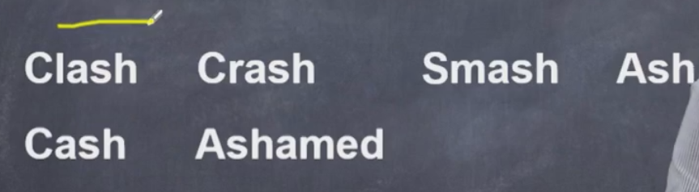
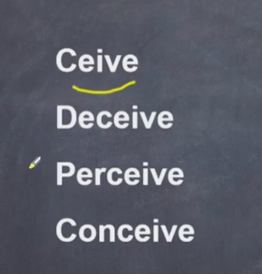
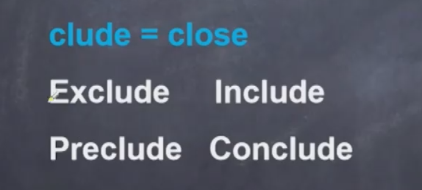
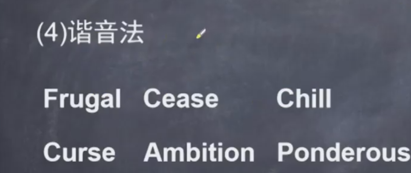
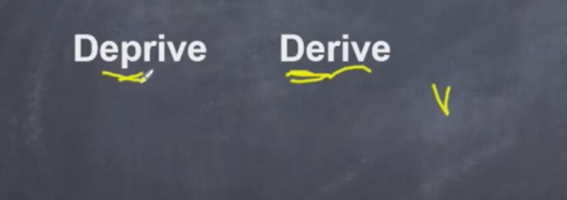

## 一、背单词方法

### 1.联想法

 

vigorous: vi代表罗马数字6；or代表人；ous 形容词后缀

`6个人的，一个人顶六个人的`，即`精力充沛的`

trivial: tri代表数字3 ，联想到**tricycle**三轮车、联想到楼下的三姑六舅，每天谈论着不重要的事情

即`琐碎的、不重要的`

moderate:模特的速度 

即`中庸的、适度的`

isolate: 爱的如此晚

即`使孤立、使隔离`

tentative: tent帐篷里，他踢我，感到很很忐忑

即`试探性的`

### 2.编故事法

clash:本拉登开着飞机可来了，`碰撞、撞击`美国世贸大楼

crash:之后世贸大楼像花一样`坍塌坠落`

smash:small+ash 此时，大楼已经变成的小灰，`粉碎`了，原因是飞机的`重击`

cash:这需要很多的`现金`才能修复

ashamed:美国人因此面露`羞愧`

deceive: 弟媳妇`欺骗`说自己怀孕了

perceive:但破媳妇`察觉`到她在说谎

conceive：实际上`怀孕`的是破媳妇，她`设想`变成大众情人

### 3.词根词缀法

clude代表关闭

exclude:把坏人关在外边：`排除`

include:把坏人关在里边：`包含`

preclude：坏人来临之前提前关闭窗户，`预防`病毒

conclude:窗户全部关闭：`结束、总结`

### 4.谐音法

frugal:  fru谐音为豆腐乳，奶奶很`节俭`只吃豆腐乳

cease: 谐音为sei si谁死不是死，生命终究会`终止`

chill : 冬天打喷嚏的声音，啊qiu~ 天气`变冷`了，`寒气`入体了

curse:客死他乡 ：`诅咒`

ambition:俺必胜，俺有`雄心壮志`

ponderous:胖的要死， `笨重的`

### 5.形近对照法

derive:弟弟走向河的源头，力量`起源、来源`于此

deprive:之后弟弟又`抢夺`河里的鲤鱼