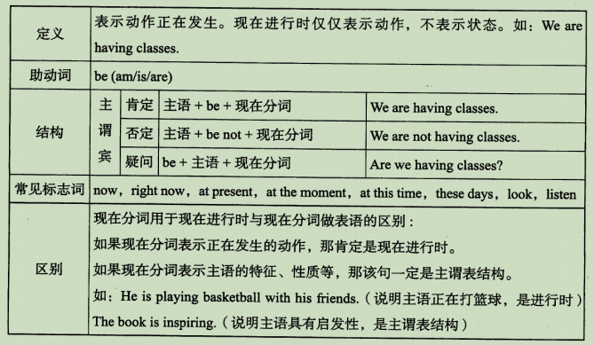
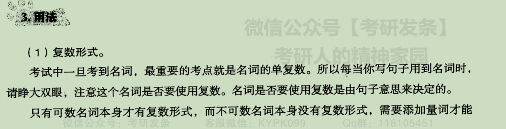
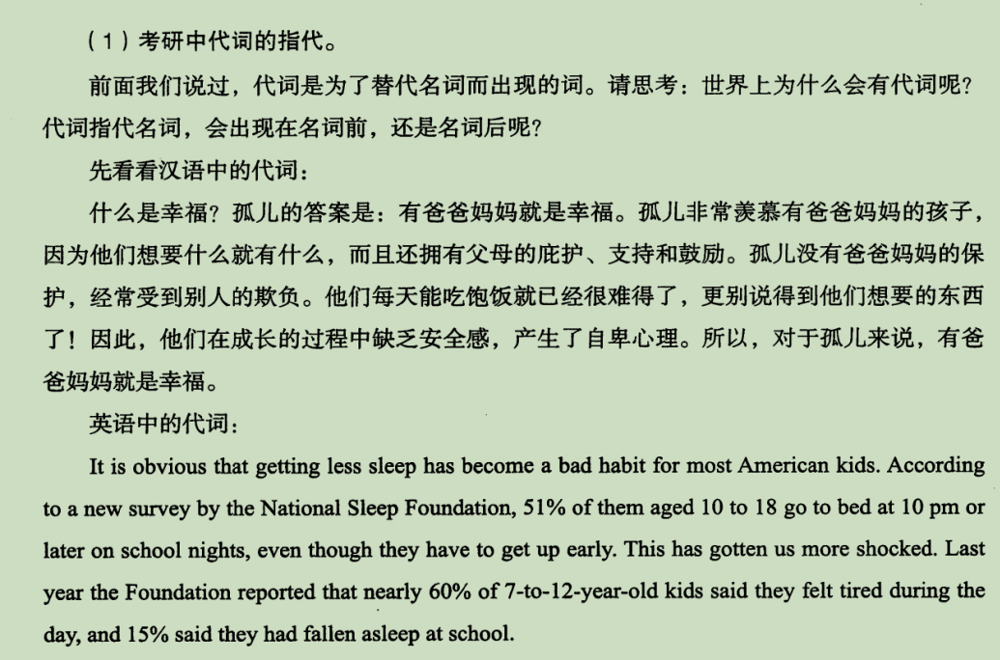
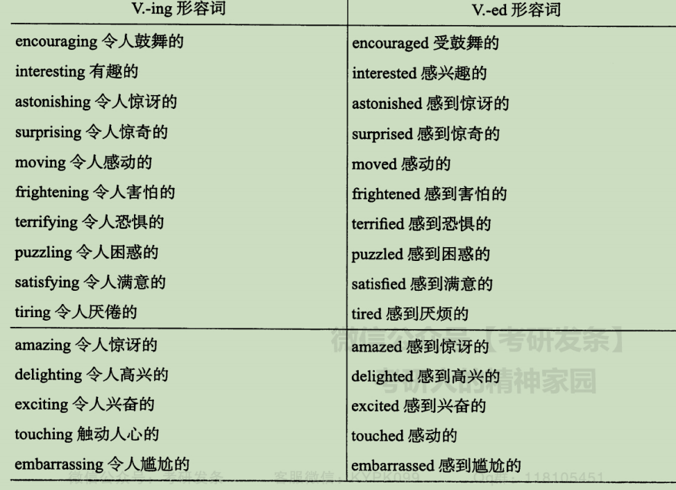

## 一、英汉结构差异

## 二、什么是英语句子

## 三、英语句子的基本结构

### 1、主谓

### 2、主谓宾

### 3、主谓表（主系表）

### 4、主谓双宾

### 5、主谓宾宾补（对宾语的补充、补足）

## 主谓宾与主谓表的区别 

### 1.区别

`主谓宾的动词是实义动词--表达动作，主谓表的动词是系动词/连系动词`

### 2.主谓宾

### 2.主谓表

### 3.特殊动词（既可作实义动词又可作系动词）

## 双宾与宾补的区别

加后翻译能否通顺，通顺的为宾补，不通的为双宾

The room is clean and tidy.

房间是干净整洁的

翻译通顺，即为宾补

We are English.

我们是英语

翻译不通，即为双宾

## 四、句子成分

### 1.谓语

### 2.非谓语

做主语

做表语

做宾语

做状语

做补语

做同位语

#### 如何确定谓语

### 3.主语

#### 主语的成分

#### 主语能否缺失

1）it做主语

2）There be句型

3）变主动为被动

4）加人称代词

### 4.宾语

### 5.表语

从上面的例子可以看出，能做表语的成分有：代词、名词（短语）、非谓语结构、形容词（短语）、介词短语、从句

比能做宾语的成分多了形容词（短语）和介词短语

### 6.时态

初学英语时，判断时态，总是用时间标志词，

综上所述，实际上要通过谓语动词（或是在具体情景的句子中，具体分析）来判断句子的时态，而时间短语/副词性标志词仅仅是描述该动作发生的具体时间。

简单来说，英语通过助动词和改变动词的形式来体现时态，而汉语是通过在谓语动词前后/当中增添词汇的方式来体现时态的

### 7.时态通用规律

#### 1）一般现在时

#### 2）一般将来时

#### 3）现在进行时

#### 4）一般过去时

#### 5）现在完成时

#### 6）过去进行时

#### 7）过去将来时

#### 8）过去完成时

#### 9）现在完成进行时

#### 10）过去完成进行时

#### 11）将来完成时

#### 12）将来进行时

#### 13）过去将来进行时

#### 14）过去将来完成时

#### 15）将来完成进行时

#### 16）过去将来完成进行时

#### tips

### 8.动词

#### 1)实义动词

#### 2）连系动词（be动词和半系动词）

#### 3）情态动词

##### 举例

#### 4）助动词

#### tips

### 9.写作

#### 1）不会写的单词替换成自己会的

#### 2）不会的长难句用简单句表达

### 10.长难句分析

#### eg1

#### eg2

#### eg3

#### eg4

#### eg5

### 11.名词

#### 用法

#### 名词所有格

#### tips

### 12.冠词

#### 用法

#### tips

### 13.代词

#### 1）人称代词

#### 

#### 2）物主代词

#### 3)反身代词

#### 4）不定代词

#### 5）指示代词

#### tips

### 14.形容词

#### ing与ed

#### 比较级

#### 

### :stars:常用

#### exercise

### 15.动词

### 16.副词

### 17.介词

#### 固定搭配

### 18.独立主格

## 概念

我们称动作状态实行者为[逻辑主语](https://baike.baidu.com/item/逻辑主语?fromModule=lemma_inlink)，称该状态为逻辑谓语，在中文翻译上与[状语从句](https://baike.baidu.com/item/状语从句?fromModule=lemma_inlink)没什么区别。

“[独立主格结构](https://baike.baidu.com/item/独立主格结构?fromModule=lemma_inlink)”是由名词或代词作为逻辑主语，加上分词、形容词、副词、动词不定式或介词短语作为逻辑谓语构成。这种结构在形式上与主句没有关系，通常称为“独立主格结构”。

## 功能与特点

### 功能

“[独立主格结构](https://baike.baidu.com/item/独立主格结构?fromModule=lemma_inlink)”在句中的功能就相当于一个带有自己[主语](https://baike.baidu.com/item/主语?fromModule=lemma_inlink)的[状语从句](https://baike.baidu.com/item/状语从句?fromModule=lemma_inlink)。众所周知非限制性从句通常以主句的某一成分作为自己的[逻辑主语](https://baike.baidu.com/item/逻辑主语?fromModule=lemma_inlink)，从而依附于主句。而有些非限制性从句和无[动词](https://baike.baidu.com/item/动词?fromModule=lemma_inlink)从句带有自己的主语，在结构上与主句不发生关系，因此成为独立主格结构。其实，虽然叫做独立主格结构，并不是真正的独立，它还是一种从属分句，在句中有多种作用。如：表原因、表条件、表方式、表伴随、表时间等，在句中通常起[状语](https://baike.baidu.com/item/状语?fromModule=lemma_inlink)作用。有时还可以做定语 。

独立主格结构主要用于描绘性文字中，其作用相当于一个状语从句，常用来表示时间、原因、条件、行为方式或伴随情况等。例如：

**1) 表示时间**

The meeting being over, all of us went home. 开完会后我们都回家了。the meeting being over相当于when the meeting was over

Her work done, she sat down for a cup of tea. 她干完了活，坐下来喝茶。her work done相当于when her work was done

**2） 表示条件**

The condition being favorable, he may succeed. 若条件有利，他或许能成功。the condition being favorable相当于If the condition is favorable

**3） 表示原因**

There being no taxis, we had to walk. 没有出租车，我们只好步行。There being no taxis相当于Since there was no taxi，

He wrapped her up with great care, the night being dark and frosty. 夜又黑又冷，所以他把她裹得严严实实的。the night being dark and frosty相当于as the night was dark and frosty

**4） 表示伴随情况**

Almost all metals are good conductors, silver being the best of all. 几乎所有的金属都是良导体，而银则是最好的导体。(=Almost all metals are good conductors, and silver is the best of all.)

**5） 表示补充说明**

We redoubled our efforts, each man working like two. 我们加倍努力，一个人干两个人的活。

***\*注：\***[独立主格结构](https://baike.baidu.com/item/独立主格结构?fromModule=lemma_inlink)表示时间、条件或原因时，相当于一个[状语从句](https://baike.baidu.com/item/状语从句?fromModule=lemma_inlink)，一般放在句首，表示原因时还可放在句末；表伴随状况或补充说明时，相当于一个[并列句](https://baike.baidu.com/item/并列句?fromModule=lemma_inlink)，通常放于句末。

### 特点

（1）[独立主格结构](https://baike.baidu.com/item/独立主格结构?fromModule=lemma_inlink)的[逻辑主语](https://baike.baidu.com/item/逻辑主语?fromModule=lemma_inlink)与句子的主语不同，它独立存在。

（2）名词或[代词](https://baike.baidu.com/item/代词?fromModule=lemma_inlink)与后面的[分词](https://baike.baidu.com/item/分词?fromModule=lemma_inlink)，形容词，[副词](https://baike.baidu.com/item/副词?fromModule=lemma_inlink)，[不定式](https://baike.baidu.com/item/不定式?fromModule=lemma_inlink)，[介词](https://baike.baidu.com/item/介词?fromModule=lemma_inlink)存在逻辑上的主谓关系，即逻辑主语为动作执行者。

（3）独立主格结构一般有[逗号](https://baike.baidu.com/item/逗号?fromModule=lemma_inlink)与主句分开（不绝对）。

## 类型

**独立主格**类型**1：**名词（[代词](https://baike.baidu.com/item/代词?fromModule=lemma_inlink)）**+现在分词**

We shall play the match tomorrow, weather permitting. 明天假设天气好，我们就进行比赛。

The monitor being ill, we’d better put the meeting off. 班长病了，我们最好还是延期开会吧。

**独立主格**类型**2：**名词（[代词](https://baike.baidu.com/item/代词?fromModule=lemma_inlink)）**+过去分词**

The job finished, we went home. 工作结束后我们就回家了。

The last bus gone, we had to walk home. 最后一班公车已经走了，我们必须走路回家。

More time given, we should have done the job much better. 如果给我们更多的时间，我们会把工作做得更好。

**独立主格**类型**3：**名词（[代词](https://baike.baidu.com/item/代词?fromModule=lemma_inlink)）**+**[不定式](https://baike.baidu.com/item/不定式?fromModule=lemma_inlink)

Nobody to come tomorrow, we will have to put off the meeting till next week. 如果明天没有人来，我们将把会议推迟到下周。

So many people to help him, he is sure to succeed. 有如此多的人来帮助他，他一定会成功的。

类型**4：**名词（代词）**+****[介词短语](https://baike.baidu.com/item/介词短语?fromModule=lemma_inlink)**

The soldiers dashed in, rifle in hand. 士兵们端着枪冲了进来。

A girl came in, book in hand. 一个少女进来了，手里拿着书。

He was waiting, his eyes on her back. 他在等着，眼睛望着她的背影。

**独立主格**类型**5：**名词（[代词](https://baike.baidu.com/item/代词?fromModule=lemma_inlink)）**+**形容词或[副词](https://baike.baidu.com/item/副词?fromModule=lemma_inlink)

He sat in the front row, his mouth half open. 他坐在前排，嘴半开着。

She sat at the table, collar off, head down, and pen in position, ready to begin the long letter. 她坐在桌前，衣领已解掉，头低了下来，拿好钢笔，准备开始写一封长信。

**独立主格**类型**6：There being +**名词（代词）

There being nothing else to do, we went home. 没有别的事可做，我们就回家了。

There being no further business, I declare the meeting closed. 没有再要讨论的事了，我宣布散会。

**独立主格**类型**7：It being +名词（代词）**

It being Christmas, the government offices were closed. 由于圣诞节的缘故，政府机关都休息。

It being a holiday, all the shops were shut. 由于今天是假日，所有商店都关门了。

## 例句

1）名词/[代词](https://baike.baidu.com/item/代词?fromModule=lemma_inlink)+形容词

It stood silent in the noon sunlight, its door open. 它的门敞开着，立在正午的阳光下。

2）名词/代词+[现在分词](https://baike.baidu.com/item/现在分词?fromModule=lemma_inlink)

The men moved slowly forward, neck deep in the water, with their officers guiding them. 在长官的带领下，这些男人在齐脖深的水里慢慢地前进着。

Winter coming, it gets colder and colder. 冬天来了，天气越来越冷了。

The rain having stopped, he went out for a walk. 雨停了，他出去散步。

The question having been settled, we wound up the meeting. 问题解决之后，我们结束了会议。

3）名词/[代词](https://baike.baidu.com/item/代词?fromModule=lemma_inlink)+[过去分词](https://baike.baidu.com/item/过去分词?fromModule=lemma_inlink)

“Marquis,” said the boy, turning to the man, his eyes opened wide, and his right hand raised. “侯爵，”男孩睁大了眼睛，举起右手，对那个男人说道。

4）名词/[代词](https://baike.baidu.com/item/代词?fromModule=lemma_inlink)+[介词短语](https://baike.baidu.com/item/介词短语?fromModule=lemma_inlink)

The huntsman entered the forest, gun in hand. 那位猎人手里提着枪走进了树林。

He sat at the table, coat off, head down, and pen in hand. 他坐在桌旁，外套脱了，头低着，钢笔拿在手中。

5）名词/[代词](https://baike.baidu.com/item/代词?fromModule=lemma_inlink)+[副词](https://baike.baidu.com/item/副词?fromModule=lemma_inlink)

Nobody in, the thief took a lot of things away. 没人在家，贼偷走了很多东西。

Lunch over, he left the house. But he was thinking. 吃过午饭后，他离开了家。但他在沉思默想。

6）名词/代词+名词

He fought the wolf, a stick his only weapon. 他和狼搏斗着，唯一的武器是一根棍棒。

7）with+名词+分词（或形容词、副词、不定式等）

He was asleep with his head on his arms. 他枕着自己的胳膊入眠。

With John away, we have got more room. 约翰走了，我们得到了更大空间。

8）名词/代词+不定式

Here are the first two volumes, the third one to come out next month. 这是前两卷，第三卷将于下月问世。

We divided the work, he to clean the windows and I to sweep the floor. 我们进行了分工，他擦窗户，我扫地。

The two boys said good-bye to each other, one to go home, the other to go to his friend’s. 两个男孩彼此道了别，一个回了家，另一个去了他朋友家。

## 注意

1.独立主格与[状语从句](https://baike.baidu.com/item/状语从句?fromModule=lemma_inlink)的转换：当状语从句的[主语](https://baike.baidu.com/item/主语?fromModule=lemma_inlink)与主句的主语不是指同一个对象时，可用[独立主格结构](https://baike.baidu.com/item/独立主格结构?fromModule=lemma_inlink)取代状语从句，但不再保留[连词](https://baike.baidu.com/item/连词?fromModule=lemma_inlink)。如：After class was over （=Class being over / Class over）, the students soon left the classroom.下课后，学生很快离开了课室。

2.不能省略being (having been)的情形：在下列三种情况下，独立主格结构中的being（或having been）不能省略。

（1）独立主格的[逻辑主语](https://baike.baidu.com/item/逻辑主语?fromModule=lemma_inlink)是[代词](https://baike.baidu.com/item/代词?fromModule=lemma_inlink)时。如：It being Sunday, we went to church. 因为是星期天，我们去了做礼拜。

（2）在There being+名词的结构中。如：There being no bus, we had to go home on foot. 因为没有公共汽车，所以我们不得不步行回家。

（3）当[独立主格结构](https://baike.baidu.com/item/独立主格结构?fromModule=lemma_inlink)中 being done 表示“正在被做时”，being不可省略。

3.通常不用[物主代词](https://baike.baidu.com/item/物主代词?fromModule=lemma_inlink)或冠词：在“名词（或代词）+[介词短语](https://baike.baidu.com/item/介词短语?fromModule=lemma_inlink)”构成的独立主格结构中，一般不用[形容词性物主代词](https://baike.baidu.com/item/形容词性物主代词?fromModule=lemma_inlink)和冠词。如： Miss Smith entered the classroom, book in hand.史密斯小姐走进了课室，手里拿着一本书。比较with的复合结构。如：Miss Smith entered the classroom, with a book in her hand.

4.独立主格结构没有[所有格](https://baike.baidu.com/item/所有格?fromModule=lemma_inlink)形式The chief-editor arriving, we began the meeting. 主编来了，我们开始开会。（比较[动名词](https://baike.baidu.com/item/动名词?fromModule=lemma_inlink)复合结构）。

#### 拓展：现在分词与动名词

现在分词相当于形容词，动名词相当于名词

**一、概念特征不同**

1、动名词，指的是动词ing形式的一种，兼有动词和名词特征的非限定动词，在句子里面不能单独充当谓语，但能在句中充当主语，宾语，表语和定语，可以支配宾语，也可以被副词修饰，有时态和语态的变化。

2、现在分词，又称-ing形式或现在进行时，是分词的一种，兼具动词和形容词特征的非限定动词，在句子里面不能单独充当谓语，但能在句中充当定语，表语，补语和状语，有时态和语态的变化。

**二、功能不同**

**1、动名词能在句中充当主语，宾语，而现在分词不能，例如：**

**A、动名词作主语**

Brushing your teeth is important.

刷牙很重要。

Hunting tigers is dangerous.

猎杀老虎是危险的。

Flying makes me nervous.

飞行使我紧张。

Smoking causes lung cancer.

吸烟会导致肺癌。

**B、动名词作宾语**

When will you ***\*give\****up smoking?

你什么时候戒烟？

She always puts off going to the dentist.

她总是推迟去看牙医。

I look forward to hearing from you soon.

我期待很快收到你的来信。

I am used to waiting for buses.

我习惯等公共汽车。

**2、现在分词能在句中充当补语，状语，独立成分和独立主格，而动名词不能，例如：**

**A、现在分词作宾语补足语**

I heard someone singing.

我听到有人在唱歌。

He saw his friend walking along the road.

他看见他的朋友沿路走。

I can smell something burning!

我闻到有东西烧焦了！

I watched the birds flying away.

我看着鸟儿飞走了。

**B、现在分词作状语**

Whistling to himself, he walked down the road.

他沿路走着吹口哨。

**解析：此句等于 He whistled to himself as he walked down the road.**

They went laughing out into the snow.

他们笑着去外面的雪里。

**解析：此句等于 They laughed as they went out into the snow.**

Dropping the gun, she put her hands in the air.

她放下枪，双手举向空中。

**解析：此句等于 She dropped the gun and put her hands in the air.**

Putting on his coat, he left the house.

他穿上大衣离开了家。

**解析：此句等于 He put on his coat and left the house.**

**三、动名词与现在分词作表语和定语的区别**

**1、作表语的区别**

**A、动名词与主语指的是同一件事，此时系动词相当于“是”，通常把主语和表语的位置互换，语法和意思不变，例如:**

My hobby is swimming.

我的爱好是游泳。

**解析：可以改为：Swimming is my hobby.**

One of his duties is attending meetings.

他的职责之一是参加会议。

The hardest thing about learning English is understanding the gerund.

学习英语最难的是理解动名词。

One of life's pleasures is having breakfast in bed.

生活的乐趣之一是在床上吃早餐。

**解析：以上例句表语和主语可以互换位置。**

**B、现在分词作表语主要用以说明主语的性质，不能与主语互换位置，例如:**

The story is interesting.

这个故事很有趣。

**解析：不可以改为：Interesting is the story.**

He was singing.

他在唱歌。

They have been walking.

他们一直在走。

We will be staying.

我们会留下来。

She would have been expecting me.

她会一直在等我的。

**解析：以上例句表语和主语不能互换位置。**

**2作定语的区别**

**动名词修饰名词时主要表示该名词的用途，而现在分词修饰名词的性质状态或动作等试比较：**

a swimming suit = a suit for swimming

游泳衣

**解析：动名词 swimming 表明 suit 的用途。**

a swimming boy = a boy who is swimming

一个正在游泳的男孩

**解析：现在分词 swimming 表示被修饰名词 boy 的动作。**

a sleeping car = a car which is used for sleeping

卧车（被用来睡觉的车厢）

**解析：动名词 sleeping 表明 car 的用途。**

a sleeping child = a child who is sleeping

一个正在睡觉的孩子

**解析：现在分词 sleeping 表示被修饰名词 child 的动作**