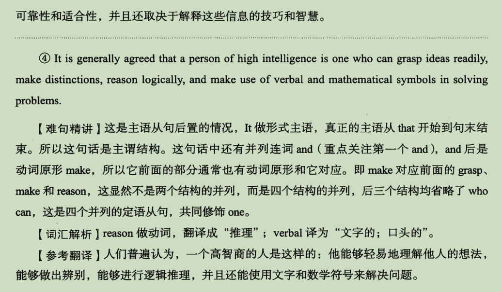
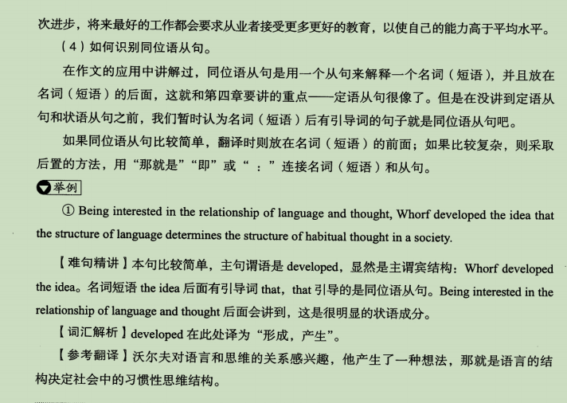

## 一、名词短语能做什么成分

## 二、什么是名词性从句

### 1.什么是从句

### 2.什么是名词性从句

`主宾表同`

#### tips

### 3.名词性从句的引导词

## 三、名词性从句的应用

### 1.主语从句

### 2.同位语从句

### 3.长难句分析

#### 1）如何识别主语从句

#### 2）如何识别宾语从句

#### 3）如何识别表语从句

#### 4）如何识别同位语从句

