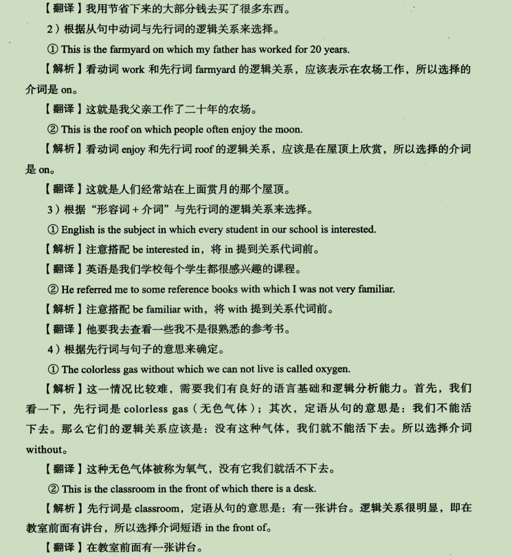
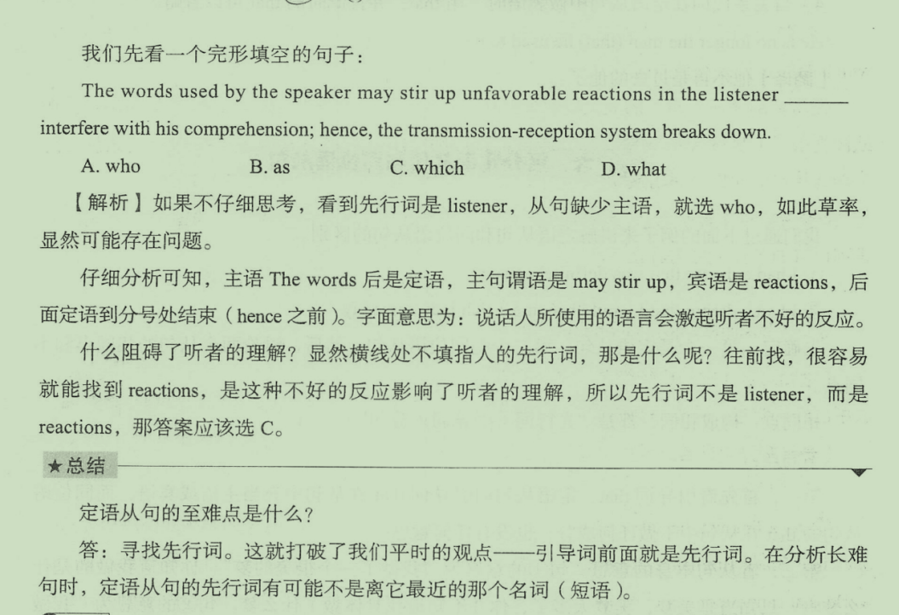
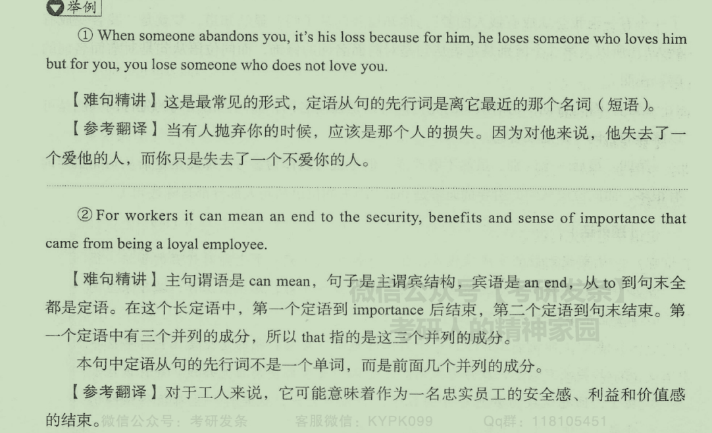
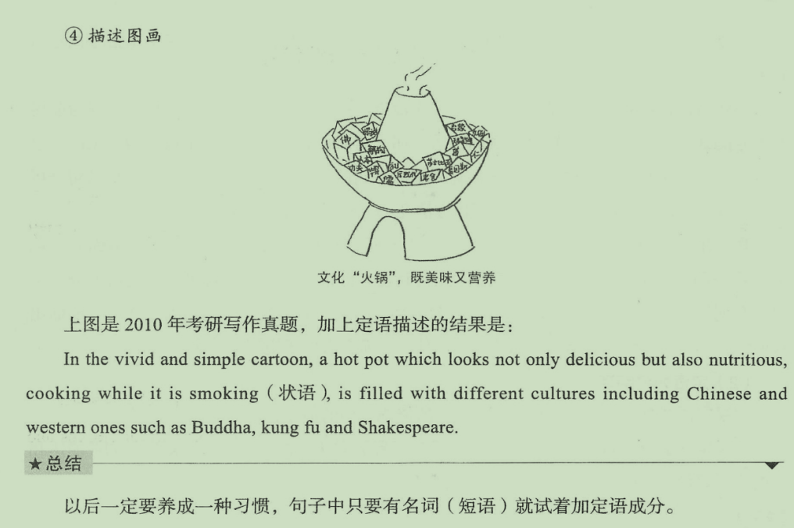

## 一、什么是定语

## 二、定语的成分

## 三、定语的位置

## 四、定语从句

### 1.构成

### 2.引导词

### 3.举例

## 五、定语从句的特殊用法

### 1.that做宾语

### 2.限制性与非限制性

### 总结

### 3.介词+关系代词引导

### 4.固定搭配the same as/that引导

### 5.as和which引导的非限制性定语从句

### 6.引导词which和that的区别

### 7.先行词是人时，that和who的区别

## 六、区分定语从句和同位语从句

## 七、定语从句的难点

## 八、定语和定语从句的应用

### 1.写作

### 2.长难句分析

