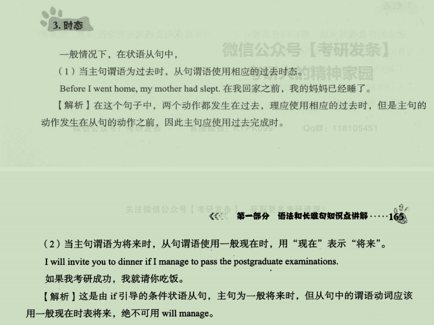
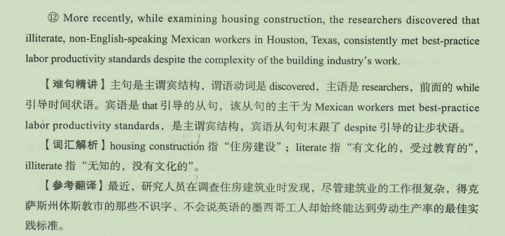
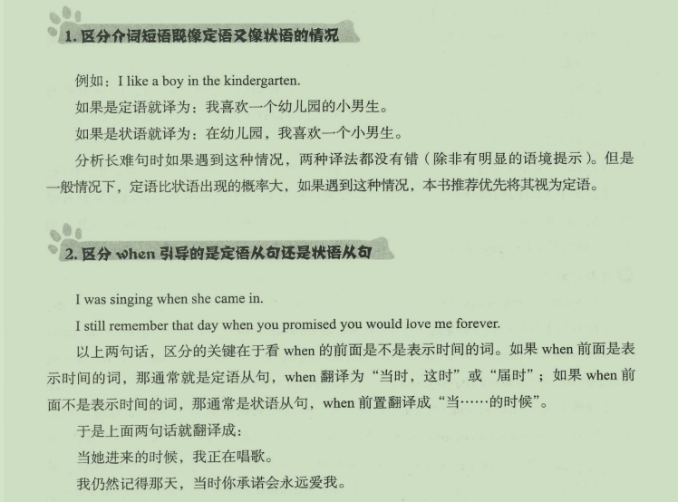

## 一、形容词（短语）和副词（短语）

## 二、状语

## 三、状语从句

### 1.构成

### 2.引导词

### 3.时态

### 4.九大状语从句

#### 1）时间

#### 2）地点

#### 3）原因

#### 4）目的

#### 5）结果

#### 6）条件

only if 与if only

一、用法不同

1、if only

用法：if only 用于虚拟语气，它用来表达一个不可能实现的愿望或假设。

与过去事实相反,后面跟过去完成时，had+过去分词。

与现在事实相反,后面跟一般过去时。

与将来事实相反,后面跟一般过去时或should + 动词原形。

2、only if

用法：用于引导条件状语从句，比if所表达的语气更强烈。置句首可引起倒装。

二、含义不同

1、if only

释义：要是...就好了。

2、only if

释义：仅仅如果。

三、侧重点不同

1、if only

解析：if作为从属连词,可引导条件状语从句、让步状语从句和名词从句。

2、only if

解析：if可引导名词性从句,作“是否”解,常放在ask, doubt, know, learn, see, wonder等动词后。一般用在口语中，而且不能用于句首。

#### 7）让步

#### 8）方式

#### 9）比较

#### 总结

## 四、分词作状语

#### 状语从句转为分词做状语

#### 是否非得出现状语从句才能使用分词做状语

## 五、状语从句的应用

### 1.写作

### 2.长难句分析

## 六、定语与状语的区别

## 七、句子成分总结

#### 总结一

#### 总结二

## 补充as

#### as+名词（短语）

#### 动词（词组）+名词（短语）+as

#### as引导定语从句

#### as引导状语从句

