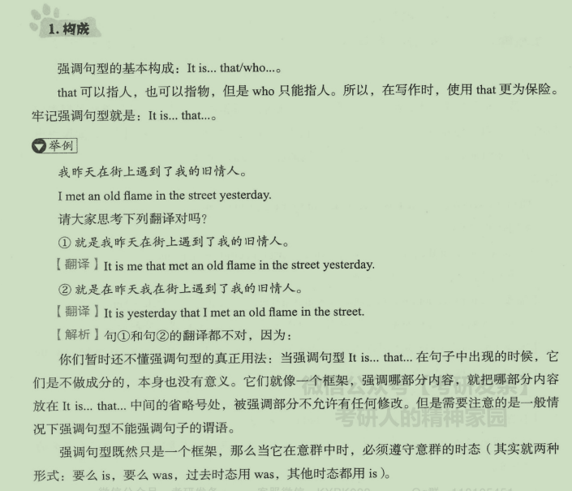

## 一、强调句型

### 1.构成

### 2.应用

## 二、虚拟语气

### 1.什么是虚拟语气

### 2.一般用法

### 3.特殊用法

### 4.应用

#### 1）写作

#### 2）长难句分析

## 三、倒装

### 1.什么是倒装

### 2.具体用法

### 3.应用

#### 1）写作

#### 2）长难句分析

## 四、插入语

### 1.含义

### 2.常用插入语

### 3.应用

#### 1）写作

#### 2）长难句分析

