我们知道，特征向量的公式是

​                    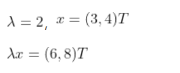                                            

其中A代表矩阵，x代表特征向量，代表特征值。

众所周知，特征值是一个数字，一个数字乘以一个向量，相当于把向量进行了伸缩。举个例子：

​                                                    (3,4)T代表矩阵的转置。向量是列向量。

显然，相较于，方向没有变化，只是大小发生了变化。即向量发生了伸缩。

注意上面的公式，左右两边是由等号连接的。因此，可以理解为一个矩阵乘以一个向量的效果是让该向量进行了一个方向不变的伸缩。

所以特征值和特征向量的通俗解释是：

1、矩阵是一个向量的变换方式。

2、特征向量就是该向量经过某一矩阵变换之后其方向不变的向量。

3、特征值是一个伸缩倍数。

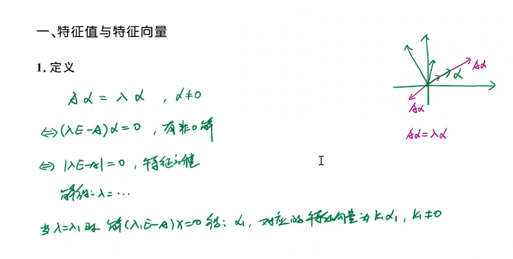

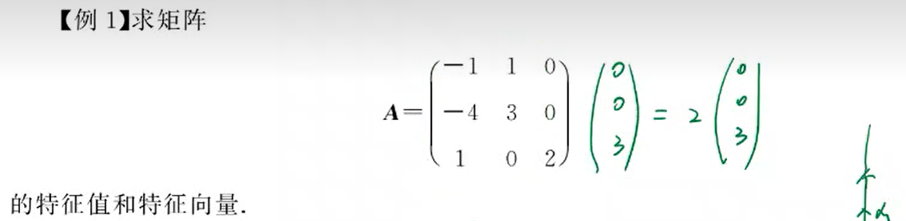

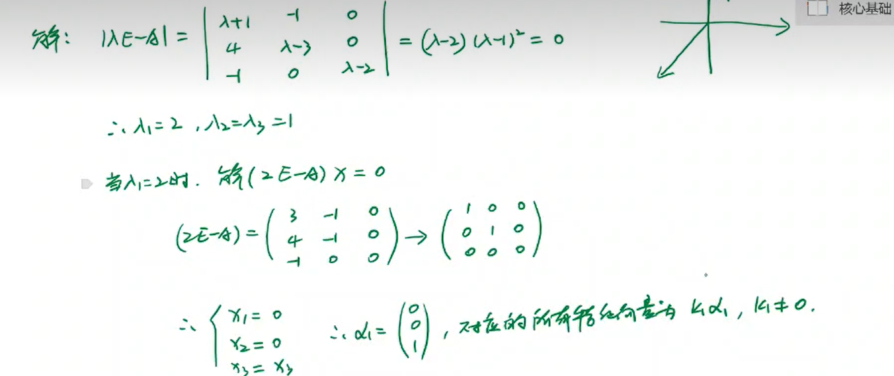

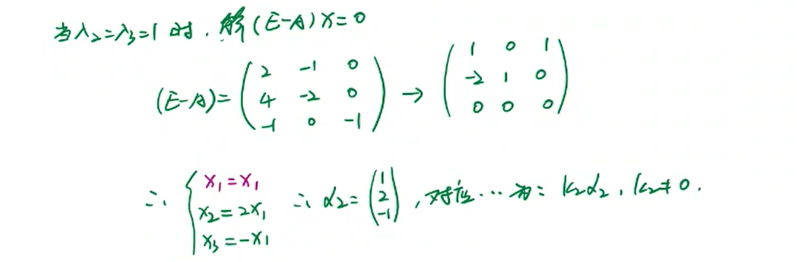

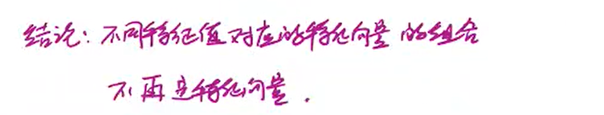

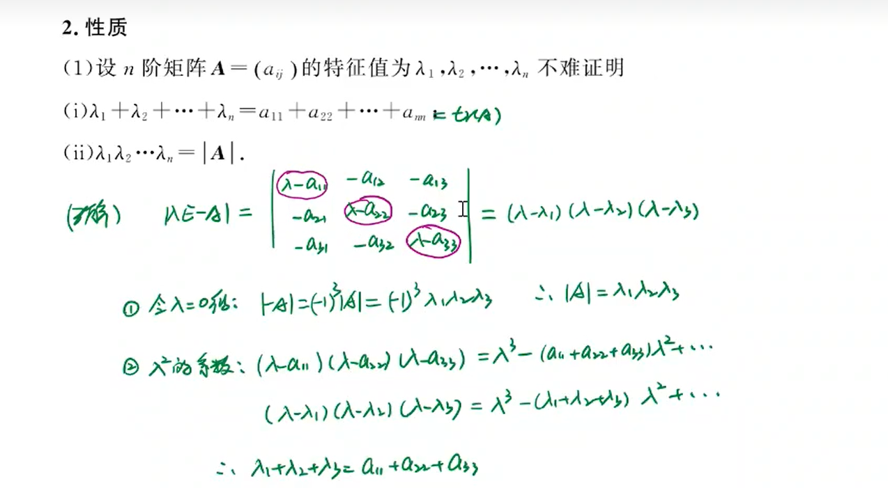

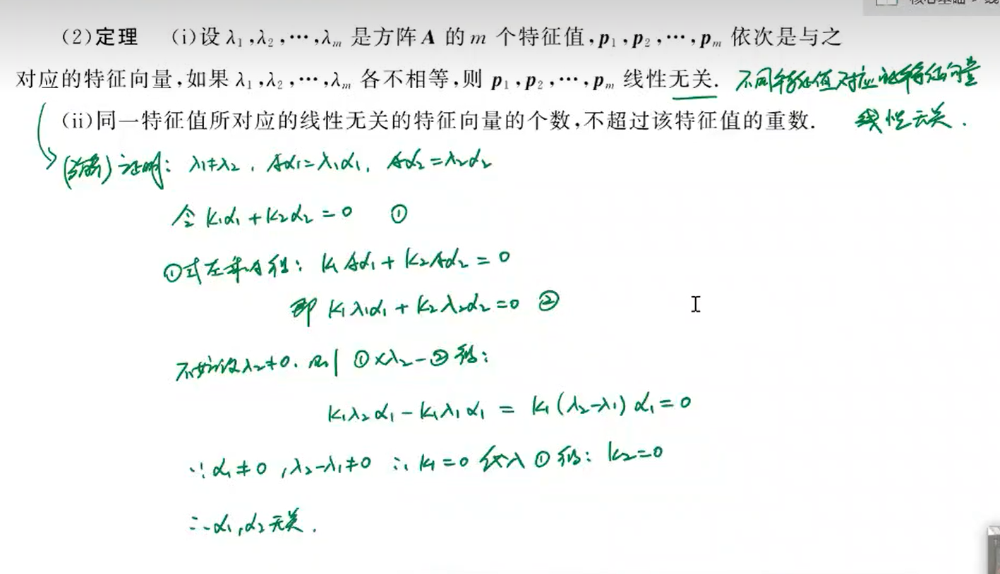

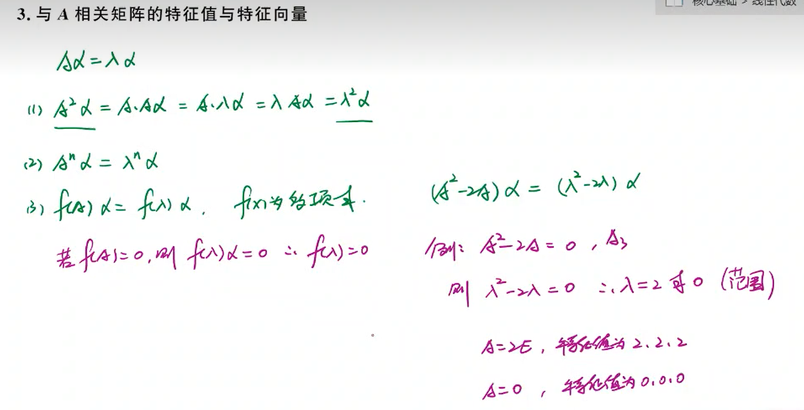

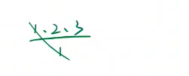

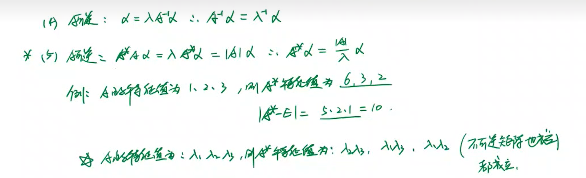

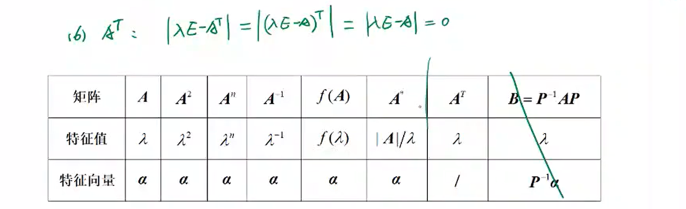

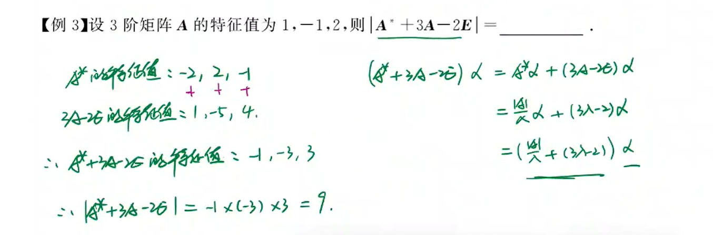