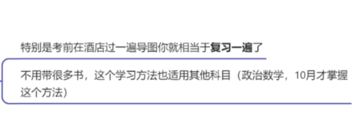
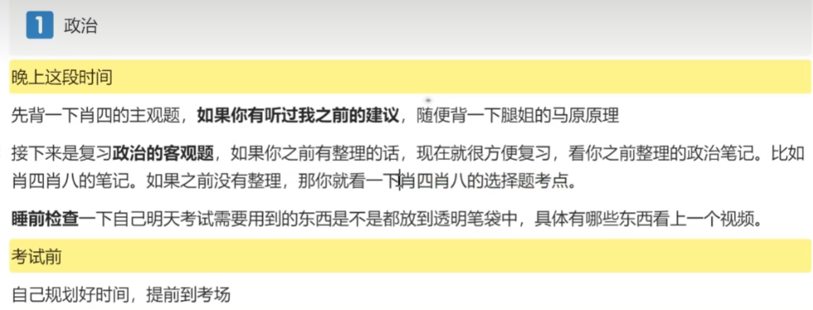
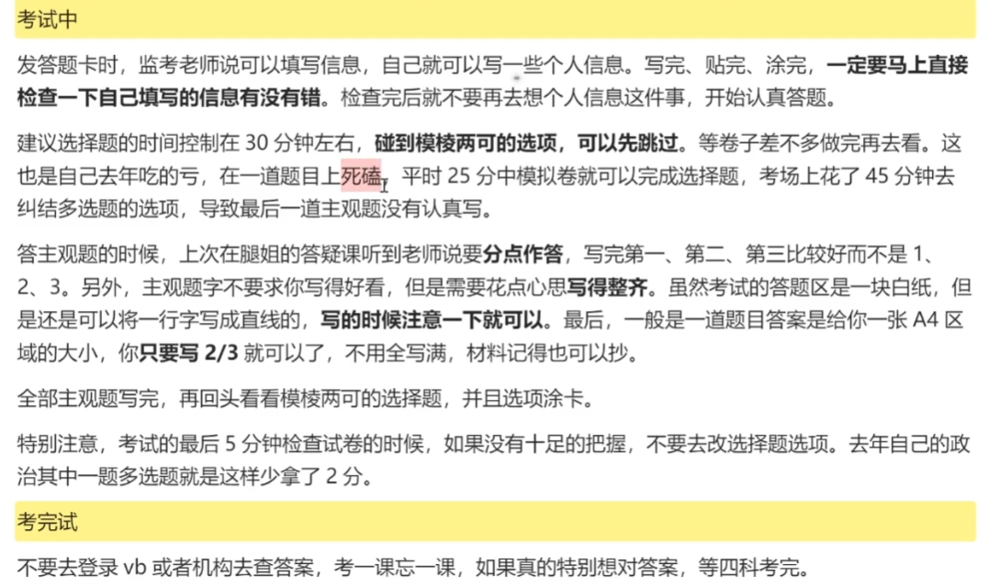
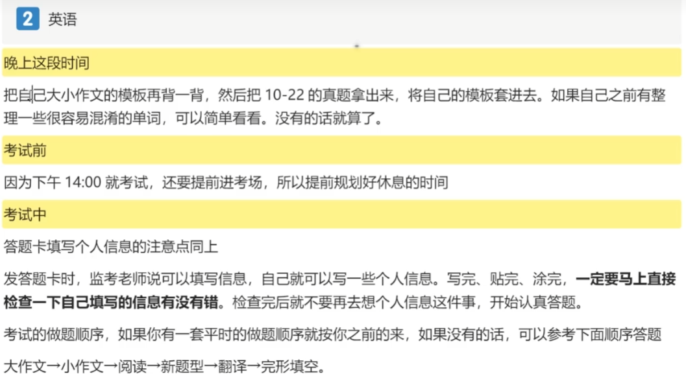
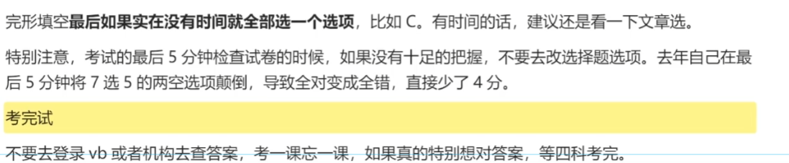
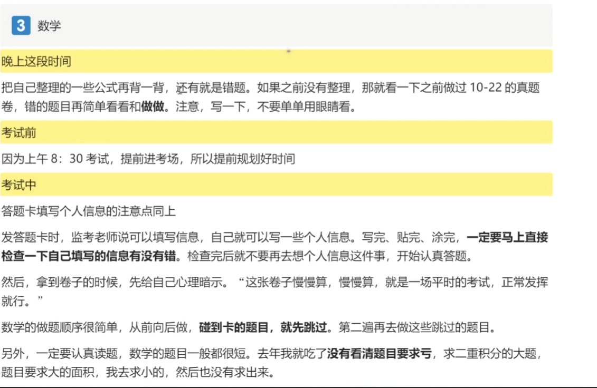
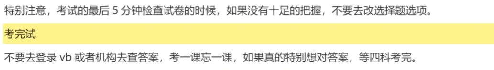
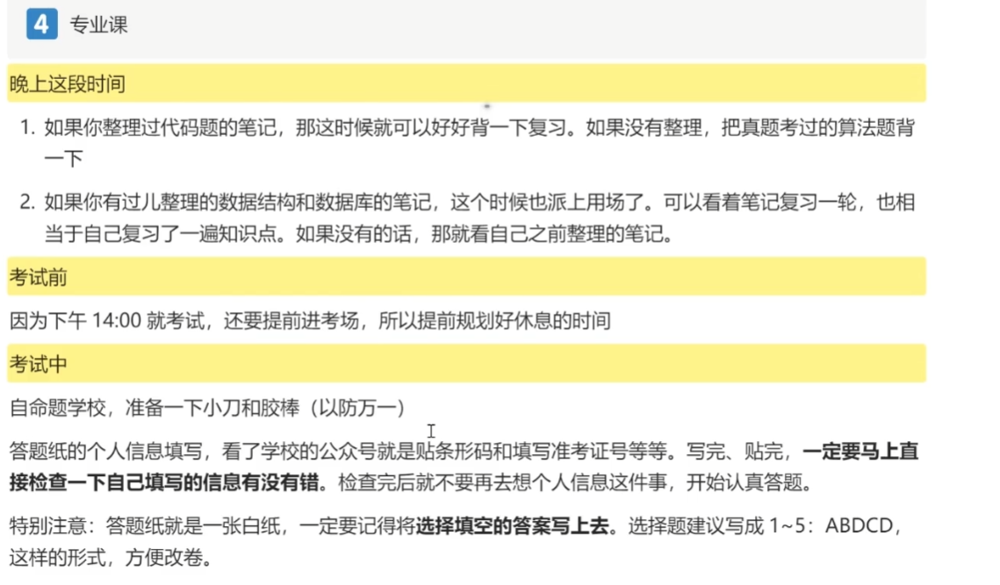
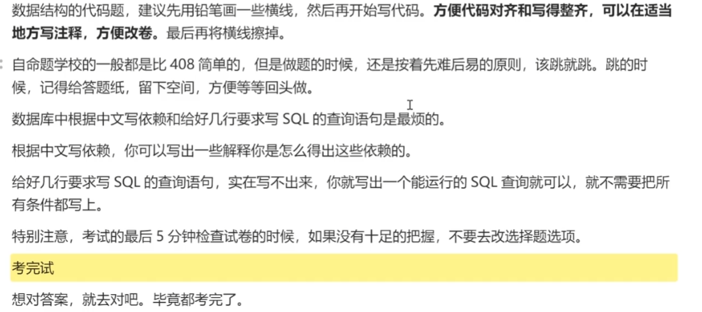

 

### 英语

| 阶段         | 规划                                              | 建议                                                         |
| ------------ | ------------------------------------------------- | ------------------------------------------------------------ |
| 大三寒假-4月 | 1.背单词（一轮） 2.语法长难句 3.阅读真题 | 1.百词斩（100）及考研词汇闪过实体书（1list)/天 2.每天精读一篇真题阅读全文，分析句子（长难句）结构（主谓宾、主系表、同位语、状语、定语），翻译长难句（单词及句子的翻译写到对应的英文旁边） 3.每天早上读一遍阅读（将含有不认识单词的句子/之前分析不好的长难句背下来） 4.计时真题阅读每天一篇（回归原文+总结错因） `先做真题，再精读` |
| 5-8月        | 1.背单词（二轮） 2.五个专项真题（近19年）    | 1.百词斩（100）及考研词汇闪过实体书（1list)/天 2.作文每周背一篇范文/根据模板写一篇 3.小三门（完型、新题型、翻译）+阅读+写作：  先听网课做题技巧并根据具体真题总结到typora（截图+文字） 之后使用技巧做专项，每天一个专项 4.计时做题；每次做完核实对错（明确某个空为什么选/不选，类比给他人讲课）； 能够翻译与答案相关的句子；第二天背专项中出现的长难句及含有不认识单词的句子 |
| 9-10月       | 1.背单词（三轮） 2.二刷近八年真题            | 1.结合原文，背前两个阶段专项上标记的单词 2.计时，使用做题技巧做真题，每四天一篇，并核实对错（明确某个空为什么选/不选，类比给他人讲课） |
| 11月-考前    | 1.高频词汇 2.重刷近3年真题                   | `保证心态稳定、放松自信即颠峰` 1.词汇闪过高频词及专项上标记的单词每天一遍 2.回顾专项做题技巧，复习自己总结的作文表达，每周写一篇（可结合专项冲刺课复习技巧、作文押题课选择作文题目） 3.重刷近三年真题保持手感 |

### 数学

| 阶段         | 规划                   | 建议                                                         |
| ------------ | ---------------------- | ------------------------------------------------------------ |
| 大三寒假-5月 | 巩固基础               | 网课：武忠祥全程班（高数线代基础、专项课、选填题技巧）+刘金峰线代 习题：复习全书+高等数学基础篇+数学基础过关660 |
| 6-8月        | 强化课                 | 武忠祥强化课（17堂课）+数学强化通关330                       |
| 9-10月       | 真题（从近几年往回刷） | 数学历年真题每天一套+准备错题本抄题，留下近三年错题以备考前复习 |
| 11月到考前   | 模拟题                 | 复习错题本；做模拟题                                         |

### 专业课

| 阶段         | 规划                      | 建议                                                         |
| ------------ | ------------------------- | ------------------------------------------------------------ |
| 大三寒假-6月 | 打牢基础：数据结构+数据库 | `根据考纲进行复习，与考纲沾边的点都是重点，都需要看看` `数据库教程课本至少读三遍并自己总结核心到typora` 1.网课：王道数据结构+B站过儿数据库系统教程 2.习题：王道数据结构+数据库系统教程习题解答 可根据导图串知识点，算法重点关注；每天十分钟复盘当天所学内容 翻书（王道数据结构考研指导+数据库系统教程） |
| 7-8月        | 专业课真题                | 1.3天一套并总结选择题的考点（写在习题旁边） 2.总结错题（电子版截图到word）及思维导图 思维导图内容：真题上及课后题出现的、书上可能成为考点的知识点 标记导图旁边：视图是从若干基本表或其他视图构造出来的虚表【2011】（代表2011年真题出现过） |
| 9-10月       | 错题                      | 二刷真题错题及书后练习题错题 完善第二阶段的导图；过一遍PPT |
| 11月-考前    | 导图+模拟题               | 记时二刷近三年真题、做王道模拟题 复习思维导图           |

### 政治

| 阶段         | 规划                                                 | 建议                                                         |
| ------------ | ---------------------------------------------------- | ------------------------------------------------------------ |
| 6‐9月        | 徐涛强化班 徐涛核心考案 肖1000             | 1.徐涛课1.5h/d 2.肖1000 :20题/d（政治刷题小程序） 听课时无需记笔记（后期课程会整理）/适当补充核心考案没有的 |
| 10-11 月     | 徐涛技巧班及冲刺班 徐涛冲刺背诵笔记 肖1000 | 1.课：2-3h/d （关注选择及主观题答题技巧） 2.二刷肖1000错题 以肖8为中心，背选择题所有的知识点、分析题看答案组成结构 |
| 11月中-12 月 | 徐涛押题班 肖4、肖8                             | 1.肖4、肖8往死里背、尤其是主观题与分析题 2.时政关注肖4肖8中出现的热点即可 |

`主观题需要写很多字，每天抽出十五分钟练习正楷；养成分点作答结合材料的习惯；马原部分可看思维导图辅助理解和记忆`

`6月份开始后续的书籍，出版日期 肖1000：6月；肖8：11月中；肖4：12月初；徐涛冲刺背诵笔记：7月份`

### Tips

 ==1网课酌情倍速==

==2英语作文好的表达及专业课的知识点每周同步到github==

==每天晚饭后十五分钟练正楷（为了政治大题工整做铺垫）==

==4typora中配置pancdoc可实现typora转word以便后续打印==

==导图软件推荐幕布==

至少提前2天去考点订酒店

 

 >After sowing,just reaping.

 

 

 

 

 

 

 

 

 

 

 

 

 

 

 

 

 

 

 

 